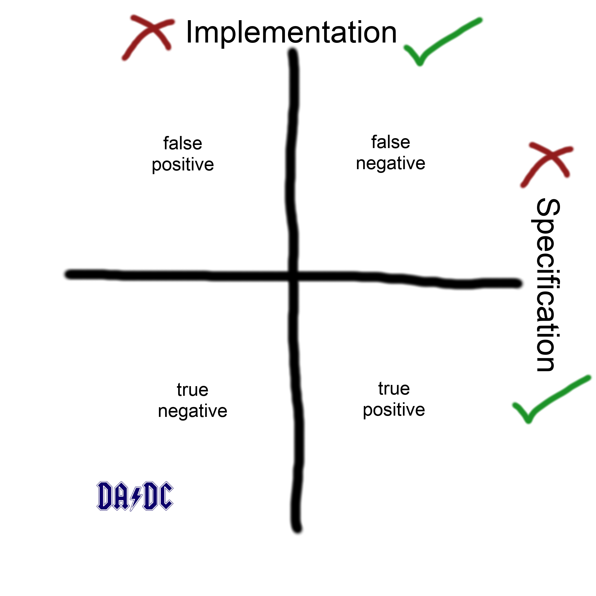

The DApps Dev Club held its fifth session,
about testing smart contracts,
a couple of days ago, on Tuesday evening at BitTemple.

We spent some time covering software testing in general,
and capped that off with an introduction to testing vanilla Javascript
using **Mocha** as a test runner.
Subsequently, we built upon that by using **truffle test** to test
smart contracts in Solidity.

Our videos are already up,
and our [video post for this session](/blog/2019-05-01-dapps-dev-club-5th-session-videos/ "Videos from DApps Dev Club Session #05 on Testing")
has you covered!

<!-- excerpt -->

## Rescheduling

This session was originally scheduled to run on Tuesday 23rd April 2019,
but BitTemple needed to reschedule us.
We tried our best to find an alternative venue on the same date.
Securing a venue for a tech meetup is extremely difficult -
let alone securing one at short notice -
and our efforts were in vain.

So we held our session exactly one week later on Tuesday 30th April 2019,
instead.
Apologies to everyone who was inconvenienced,
we wish that we had more within the locus of our control.
For those of you who had RSVP'ed for the original date,
but were not able to make it to the rescheduled date,
hopefully you're able to catch up by watching
[the videos](/blog/2019-05-01-dapps-dev-club-5th-session-videos/ "Videos from DApps Dev Club Session #05 on Testing")!

## Format

Continuing with the bar set in the previous session,
this one was almost entirely comprised of hands-on stuff,
and very little theory from a slide deck.

Fun fact **#1**:
In session #05 we broke the record for number of hands-on parts attempted -
but we did not manage to get through the final one, so &hellip 🤷.

Fun fact **#2**:
This session was also the first time there was a blunder in a live demo.
As the stuff that we are dealing with gets more complex,
this is probably going to happen more frequently.
Frankly I'm pleasantly surprised that we have managed to get through as many
sessions without one as we have -
the demo gods have indeed been kind to me so far! 😇

## Difficulty and pace

In previous sessions, some of you have given us feedback that the pace was
either too fast or too slow.
We've taken that on board and experimented a little.
This time for each of the hands-on parts,
we included a little stretch goal,
which was more or less:

"Do this task &#95;&#95;&#95;, but we're not telling you how,
you need to figure it out on your own.
BTW, here are some hints: &#95;&#95;&#95;"

That seemed to work really well, because after the session,
those of you who talked to me all said that the pace was right.
This is the first time that that has happened in our sessions! 🎉🎉🎉

## Above and beyond

A few of you who attend these sessions have really stepped up,
going from attending the sessions, to actively helping out.

Thanks [Kenneth Goh](https://www.linkedin.com/in/kenneth-goh-65ba9525/)
for helping out during the session,
and getting people unstuck where they've gotten stuck.

Thanks [Jack Ng](https://www.linkedin.com/in/jack-ng-b2593b151)
for also helping out during the session,
and getting people unstuck.
Also, for **reviewing** my hands-on materials prior to the session,
and giving me quite **detailed feedback** on it -
which was certainly put to good use!

You deserve a shout out for being awesome! 🙌🙌
The session would not have progressed as **smoothly** as it did without you!

## Topics

### Mocha

- [Deck](https://dappsdev.org/deck/s01e05/#mocha)
- [Hands-on](/hands-on/mocha-intro/)

In our very first section,
we ditched smart contracts, Solidity, and decentralised application development
entirely, and focused purely on Javascript instead.
The idea here was to lay the foundation for the next sections.

The learning objectives here were threefold:

- Testing and software engineering principles
- Writing tests to be run by Mocha
- Javascript (the language)

Let's summarise each of them next.

#### Testing and software engineering principles

We discussed the implementations, specifications, test runners,
and the relationship between the three.

We also discussed what I'm choosing to call the
**implementation specification correctness quadrants**:

(you'll have to excuse my terrible graphic design skills -
I clearly have yet to get past the mspaint.exe level of ability)

#### Writing tests to be run by Mocha

Here we discussed the basics like the `describe` and `it` blocks,
and how to use them.
We also took a look at using `assert` (the NodeJs core module)
to write assertions within our tests.

We also did a brief detour, for those who were new to it,
into using git and github for version control of your project folder.

If you have followed along with the hands-on parts
during our sessions, or even in your own time,
please commit, push, and add a link to your project in
[our chat group](https://bit.co/dadc-chat "DApps Dev Club chat group") -
it would be great to see some of the stuff that we have all built together!
🔥🔥🔥

#### Javascript (the language)

This was more of an implicit goal rather than an implicit goal.
When we asked for a show of hands for who has written Javascript before,
and less than half of you present raised your hands.
However, everyone was able to follow along with the hands-on parts,
so gentle on-ramping of the language looks like it worked!

### Truffle testing set up

- [Hands-on](/hands-on/testing/truffle-setup/)

This section was a very brief interlude between going from using
Mocha to test vanilla Javascript files,
to using truffle to test Solidity smart contracts.

The focus here was mainly pointing out the 1% extra features that
truffle test has that are built on top of Mocha.

### Data storage

- [Deck](/deck/s01e05/#data-storage)
- [Hands-on](/hands-on/testing/solidity-data-storage/)

When a smart contract is first deployed, it already has some initial state.
This is the easiest thing for one to possibly test in a smart contract -
in terms of the complexity of the tests that need to be written -
so this is where we started!

Many of you, this was the **first time** that you have written a test
for a smart contract! 👏👏👏

For some of you, it was the **first time** that you have written a test
for a smart contract, ***and also*** the first time you have written a test
for **any type of code** at all! 👏👏👏👏👏

### State machines

- [Deck](https://dappsdev.org/deck/s01e05/#state-machines)
- [Hands-on](/hands-on/testing/solidity-state-machines/)

We began this section with a short discussion on state machines,
and state transitions, int he context of smart contracts.

> A Scilla smart contract (and in general most smart contracts that you see
> today) are stateful systems. This basically means that a smart contract at
> any point of time can be said to be in a particular "state". This "state"
> for instance can be a set of variables (and its current value) or say map
> (in the case of ERC20 token contract) that stores which user owns how many
> tokens. A state transition is a function that allows users to change the
> state of the contract. For instance, the transfer state transition function
> will allow users to transfer tokens from one user to another and hence
> changing the map.

&mdash; Amrit Kumar

We took apart the quote above, by one of the creators of Scilla,
the programming language used to write smart contracts for a different network,
and discussed what it means, and what the implications are for writing
smart contracts in platforms such as the Ethereum Virtual Machine.

Next, we did a hands-on where we wrote tests for state transitions.
There is a really interesting bit about the return values of Solidity
functions which are state transitions (so go check it out).

As part of this hands-on, we also got to experiment with the
**clean-room environment** that the `contract` block from truffle test.

### Events

- [Deck](/deck/s01e05/#events)
- [Hands-on](/hands-on/testing/solidity-events/)

Here we discussed how events in Solidity map to logs in Ethereum,
as well as the distinction between "logs" and "structured logs".

In our hands-on we then wrote some tests for events.

We also introduce the `before` block from Mocha at this point.

### Mocking

- [Deck](/deck/s01e05/#mocking)
- [Hands-on](/hands-on/testing/solidity-mocks/)

At the beginning of this session, I said that most likely we will not get
through all of the material planned for the session,
because we have an audaciously large number of hands-on parts for this session.
True enough, that happened.

However, we managed to get through everything but the last hands-on.
So try this out for yourselves -
all the material is available at the link above!
If you have any questions, or get stuck, et cetera, reach out at
[our chat group](https://bit.do/dadc-chat "The DApps Dev Club chat group"),
or we might be able to discuss it at the beginning of session #06.

## Thanks

Thanks to
[Lifelong Learning Institute (SkillsFutureSG)](https://www.lli.sg/)
for sponsoring us via their learning circles program - you have them to thank
for the F&amp;B.

Thanks to [BitTemple](https://bittemple.io/)
for hosting us at their excellent space.
Thanks Solomon for helping us run the event,
and helping with the set up.

## Next session

RSVPs are now open - please let us know if you're attending, as it helps us
plan for seating, ordering F&amp;B, etc:

[**RSVP** on eventbrite](https://dappsdev-s01e06.eventbrite.com/)

🤘🤘🤘
