WIP!

## Pre-requsites

- A Github account
- SSH keys set up, and authorised in your Github account
- NodeJs set up, version `10.*`
  - Use [nvm](https://github.com/nvm-sh/nvm) to install/ manage multiple versions if necessary
- Ganache installed, version `2.1.*`
- A POSIX compliant shell or terminal
  - Linux: Your default terminal is OK
  - Mac OSX: Your default terminal is OK
  - Windows: `cmd` is **not OK**; need to install something else `git-terminal` or `WSL/2` instead

## Create a git repository

You have 2 options.
The quick way is to fork the demo repository.
The not-so-quick way is to set it up from scratch.
Both sets of instructions have been provided for your reference.

### Fork demo repository

Visit https://github.com/dapps-dev-club/smart-contract-dev-patterns-workshop and press the "Fork" button.


You should now see ...

- Click "clone or download"
- Select "clone with SSH" (you must be logged in, and have SSH keys set up)
- Copy the git url


```bash
git clone git@github.com:${YOUR_GITHUB_USERNAME}/smart-contract-dev-patterns-workshop.git

```

We roll back our local copy to the very first commit,
which which can reference by the handy tag name `step-01-01`.

```bash
git reset --hard step-01-01
```

Ensure the git remote repository (on github) has rolled back too,
to match your local git repository (on your computer).

```bash
git push -f origin master

```

### From scratch

```bash
# initialise the project
mkdir smart-contract-dev-patterns-workshop
cd smart-contract-dev-patterns-workshop
touch README.md
```

Edit your `README.md` file to add a basic description.
You may use the following, modify as you see fit:

```markdown
# Smart Contract Development Patterns Workshop

This is a **work in progress**.
Please check back here later!

## Instructions

Instructions are available
[here](http://dappsdev.org/hands-on/smart-contract-dev-patterns/).

## Author

[Brendan Graetz](http://bguiz.com/)

## Licence

GPL-3.0

```

```bash
git init
git add README.md
git commit -m "docs: add README"
git tag -a step-01-01 $( git rev-parse HEAD ) -m "step-01-01"
```

Note that `git rev-parse HEAD` simply returns the git commit hash for
the most recent commit, that you just created.

Visit `https://github.com/${YOUR_GITHUB_USERNAME}/repositories/new`

For example: https://github.com/organizations/dapps-dev-club/repositories/new


Fill in fields ...


Copy the commands at the bottom of the page ...


```bash
git remote add origin git@github.com:${YOUR_GITHUB_USERNAME}/smart-contract-dev-patterns-workshop.git
git push -u origin master
```

Refresh your project's page on github,
you should see your first commit there.

## Initialise a NodeJs project

If you are familiar with NodeJs development,
feel free to skip to the next section.

### Install dependencies

```bash
# set up npm and node packages
npm init -f
npm i --save-dev "@openzeppelin/test-helpers@0.5.4"
npm i --save-dev "solc@0.5.16"
npm i --save-dev "truffle@5.1.11"
npm i --save "@openzeppelin/contracts@2.5.0"

```

Note that, at this point, we do not need all of these dependencies yet.
We will make use of them at a later stage in this series of workshops.

At this point, you should have a `package.json` file
whose contents are similar to:

```json
{
  "name": "smart-contract-dev-patterns-workshop",
  "version": "0.0.0",
  "private": true,
  "description": "Smart Contract Development Patterns Workshop",
  "main": "contracts/Bolsilmon.sol",
  "directories": {
    "test": "test"
  },
  "repository": {
    "type": "git",
    "url": "git+https://github.com/dapps-dev-club/smart-contract-dev-patterns-workshop.git"
  },
  "keywords": [
    "solidity",
    "smart contracts",
    "development patterns",
    "workshop"
  ],
  "author": "bguiz",
  "license": "GPL-3.0",
  "bugs": {
    "url": "https://github.com/dapps-dev-club/smart-contract-dev-patterns-workshop/issues"
  },
  "homepage": "https://github.com/dapps-dev-club/smart-contract-dev-patterns-workshop#readme",
  "devDependencies": {
    "@openzeppelin/test-helpers": "0.5.4",
    "solc": "0.5.16",
    "truffle": "5.1.11"
  },
  "dependencies": {
    "@openzeppelin/contracts": "2.5.0"
  }
}

```

### Git ignore

Tell git to ignore the folder full of dependencies installed by npm,
as well as the build output from Truffle.

```bash
touch .gitignore

```

Edit the `.gitignore` file to have the following files:

```
/node_modules
/build

```

### Version control for this step

Don't forget to commit and push these changes to the git remote!

```bash
git add .
git status
git commit -m "proj: npm init + add dependencies + .gitignore"
git tag -a step-01-02 $( git rev-parse HEAD ) -m "step-01-02"
git push origin master --tags

```

You will notice, in the output of `git add .` that in addition to
`package.json` and `.gitignore`, the two files that you explicitly created,
there also exists another file, `package-lock.json`.
This is automatically generated by npm.

## Run scripts

For your convenience, it is a good idea to define some run scripts.
This will save you from having to recall and type commands that you
are likely to use frequently during development.

```json
  "scripts": {
    "info": "echo $npm_package_name $npm_package_version && truffle version && which truffle",
    "compile": "truffle compile",
    "deploy": "truffle migrate",
    "clean-and-deploy": "truffle migrate --reset",
    "test": "truffle test"
  },

```

### Version control for this step

Don't forget to commit and push these changes to the git remote!

```bash
git add -p
git commit -m "proj: npm run scripts"
git tag -a step-01-03 $( git rev-parse HEAD ) -m "step-01-03"
git push origin master --tags

```

### Side note: Git add modes

Note that in this case, instead of adding whole files using `git add`,
we added "hunks" (parts) of a file using `git add -p`.
(This is the same as `git add --patch`.)
This displays an interactive prompt for each "hunk" within a file
that differs from its previously committed version.
This gives you the opportunity to:

- Review the changes in more granular detail
- Commit, if you so choose, a subset of the changes per file instead of all changes in a file

The terminal output should look similar to:

```bash
$ git add -p
diff --git a/package.json b/package.json
index 7282adf..66d63cc 100644
--- a/package.json
+++ b/package.json
@@ -7,6 +7,13 @@
   "directories": {
     "test": "test"
   },
+  "scripts": {
+    "info": "echo $npm_package_name $npm_package_version && truffle version && which truffle",
+    "compile": "truffle compile",
+    "deploy": "truffle migrate",
+    "clean-and-deploy": "truffle migrate --reset",
+    "test": "truffle test"
+  },
   "repository": {
     "type": "git",
     "url": "git+https://github.com/dapps-dev-club/smart-contract-dev-patterns-workshop.git"
Stage this hunk [y,n,q,a,d,e,?]? y

$

```

Since there is only 1 "hunk" from 1 file in the `git diff`,
this command is a little overkill.
However, it may come in handy when following along with subsequent parts of this workshop.

You can read more about `git add --patch`,
and its close relative `git add --interactive`,
at this article on [git interactive staging](https://git-scm.com/book/en/v2/Git-Tools-Interactive-Staging).

## Intialise a Truffle project

If you are already familiar with Truffle development,
feel free to skip ahead to the next section.

### Running npm executables

We have already installed Truffle as a development dependency within this project -
look in `package.json` -
so let's use that version to initialise the Truffle project.
Use the following command to reveal all of the executables
that are available within the NodeJs modules that you have installed

```bash
$ ls -a $( npm bin )
# several others, removed for brevity
lrwxrwxrwx   1 bguiz bguiz    18 Feb 12 15:19 mocha -> ../mocha/bin/mocha
lrwxrwxrwx   1 bguiz bguiz    14 Feb 12 15:19 solcjs -> ../solc/solcjs
lrwxrwxrwx   1 bguiz bguiz    31 Feb 12 15:19 truffle -> ../truffle/build/cli.bundled.js

$

```

When you run something via `npm run`, the value of `npm bin` is
automatically prepended to the `PATH` environment variable.
(That is how the `script` section within `package.json` works.)

However to run these installed executables directly,
via a shell command, we need to do this by hand:

```bash
$( npm bin )/truffle init

```

The above command is effectively the same as running `truffle init`
within an npm run script when Truffle is installed as a dependency,
or as running `truffle init` on a global npm installation of Truffle,
or as running `npx truffle init`.

### Truffle configuration file

This should generate a file named `truffle-config.js`.
Open this file in your code editor, and modify the following values:

(1) `networks.development`:

```js
    development: {
     host: "127.0.0.1",
     port: 7545,
     network_id: 5777,
    },

```

(2) `compilers.solc.version`:

```js
      version: '0.5.16',
```

Without the comments, your `truffle-config.js` file should now look like this.

```javascript
module.exports = {
  networks: {
    development: {
     host: "127.0.0.1",
     port: 7545,
     network_id: 5777,
    },
  },
  mocha: {
  },
  compilers: {
    solc: {
      version: '0.5.16',
    }
  }
}
```

(You don't necessarily need to delete the comments, they might come in handy later.)

### Version control for this step

Don't forget to commit and push these changes to the git remote!

```bash
git add truffle-config.js
git commit -m "proj: truffle init"
git tag -a step-01-04 $( git rev-parse HEAD ) -m "step-01-04"
git push origin master --tags

```

## Ganache

### Configuring the Ganache workspace

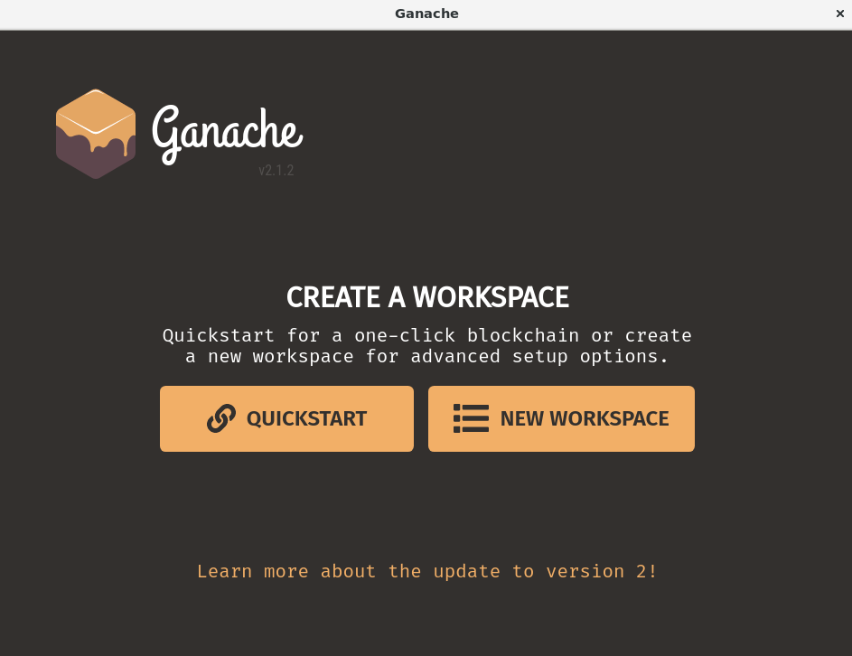

Select "Create Workspace".

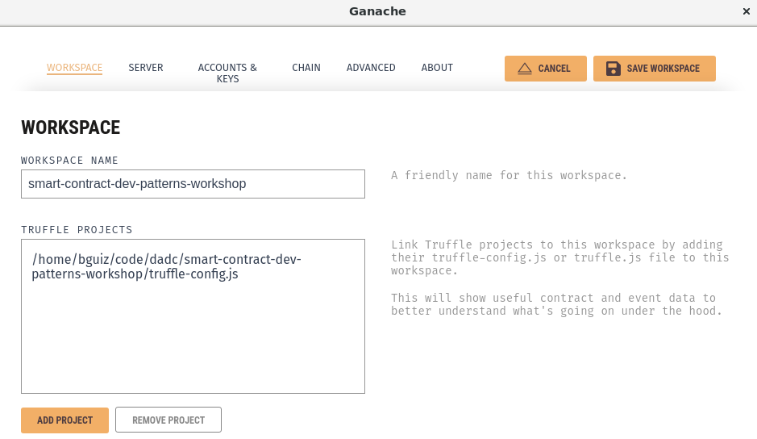

In "Workspace Name", enter `smart-contract-dev-patterns-workshop`.

Under "Truffle Projects",
click on the "Add Project" button,
and select the `truffle-config.js` file which we just created.

Click on "Save Workspace" in the top bar.

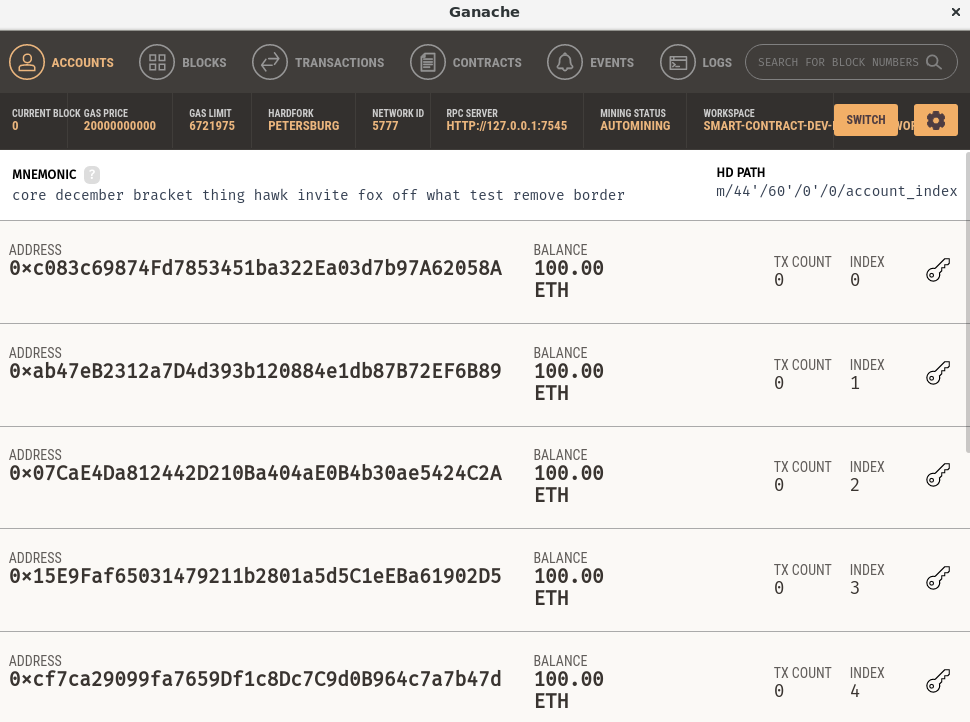

Wait for a brief moment,
and Ganache will spin up a brand new blockchain -
a simulated, in-memory, Ethereum-compatible blockchain.
You should see:

- 10 addresses, each of which with an initial balance of 100 Ether.
- A "Mnemonic" and "HD Path" (for BIP39 compatible wallets).
- "Network ID" and "RPC Server" in the darker bar at the top

When you created the Ganache Workspace,
these values were read from `truffle-config.js`.
Now when you run smart contracts via Truffle,
Ganache will respond to those requests.

### Introducing migrations

When we ran `truffle init` earlier,
it was not just `truffle config` that was generated.
That would have also generated files for migrations.
Migrations are Truffle's terminology for
deploying a smart contract to a blockchain.

```bash
$ ls migrations/
1_initial_migration.js
$ ls contracts/
Migrations.sol
$

```

The contents of `contracts/Migration.sol` should look like:

```solidity
pragma solidity >=0.4.21 <0.7.0;

contract Migrations {
  address public owner;
  uint public last_completed_migration;

  constructor() public {
    owner = msg.sender;
  }

  modifier restricted() {
    if (msg.sender == owner) _;
  }

  function setCompleted(uint completed) public restricted {
    last_completed_migration = completed;
  }

  function upgrade(address new_address) public restricted {
    Migrations upgraded = Migrations(new_address);
    upgraded.setCompleted(last_completed_migration);
  }
}
```

This is a smart contract that is used to store information about
the last completed migration.

The contents of `contracts/1_initial_migration.js` should look like:

```javascript
const Migrations = artifacts.require("Migrations");

module.exports = function(deployer) {
  deployer.deploy(Migrations);
};

```

This file performs the actual deployment of the `Migrations.sol`
smart contract that we just looked at.
We have to deploy the migrations contract to manage the
deployment of subsequent contracts.

There are other ways to manage deployments of course,
but this is the workflow that is built into Truffle,
and expected of it.

### Deploying the first contract

As we have already set up the npm run scripts earlier,
now we can simply run the following command to deploy
smart contracts within the Truffle project.

```bash
npm run deploy

```

This should output something similar to the following:

```bash
> smart-contract-dev-patterns-workshop@0.0.0 deploy /home/bguiz/code/dadc/smart-contract-dev-patterns-workshop
> truffle migrate


Compiling your contracts...
===========================
> Compiling ./contracts/Migrations.sol
> Artifacts written to /home/bguiz/code/dadc/smart-contract-dev-patterns-workshop/build/contracts
> Compiled successfully using:
   - solc: 0.5.16+commit.9c3226ce.Emscripten.clang


Starting migrations...
======================
> Network name:    'development'
> Network id:      5777
> Block gas limit: 0x6691b7


1_initial_migration.js
======================

   Deploying 'Migrations'
   ----------------------
   > transaction hash:    0x424de3a531f50e4e446d47c078f47ff7d99695e9e92ddfc3f62050c9b6873947
   > Blocks: 0            Seconds: 0
   > contract address:    0x8A340116D5E11ABe96F9200128674fC363bf08A8
   > block number:        1
   > block timestamp:     1581586658
   > account:             0xaBa61446AdC51185DD729Cb60a7590fE84803777
   > balance:             99.99472518
   > gas used:            263741
   > gas price:           20 gwei
   > value sent:          0 ETH
   > total cost:          0.00527482 ETH


   > Saving migration to chain.
   > Saving artifacts
   -------------------------------------
   > Total cost:          0.00527482 ETH


Summary
=======
> Total deployments:   1
> Final cost:          0.00527482 ETH

```

This compiles and deploys the `Migrations` smart contract,
and will take a few seconds to complete.

### A tour of Ganache

Look at Ganache again, and you should notice that its state has changed.

In the "Accounts" tab, you will notice that the first account
has depleted some of its balance:
Instead of 100.00 Ether, it now shows 99.99 Ether.
This is because deploying a contract is
like any other transaction written to a blockchain:
It consumes both processing power or storage space,
which must be paid for in Ether.
This is the *gas fee*, and has been deducted from the first account.

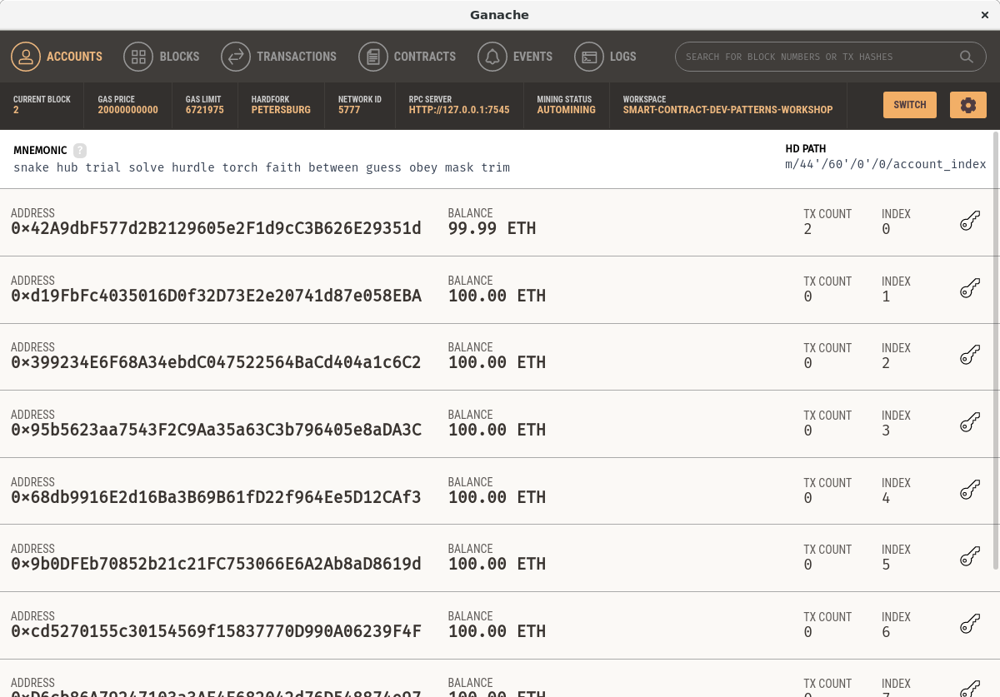

In the "Blocks" tab, you will notice that there are 2 new blocks,
each of which contains a single transaction.

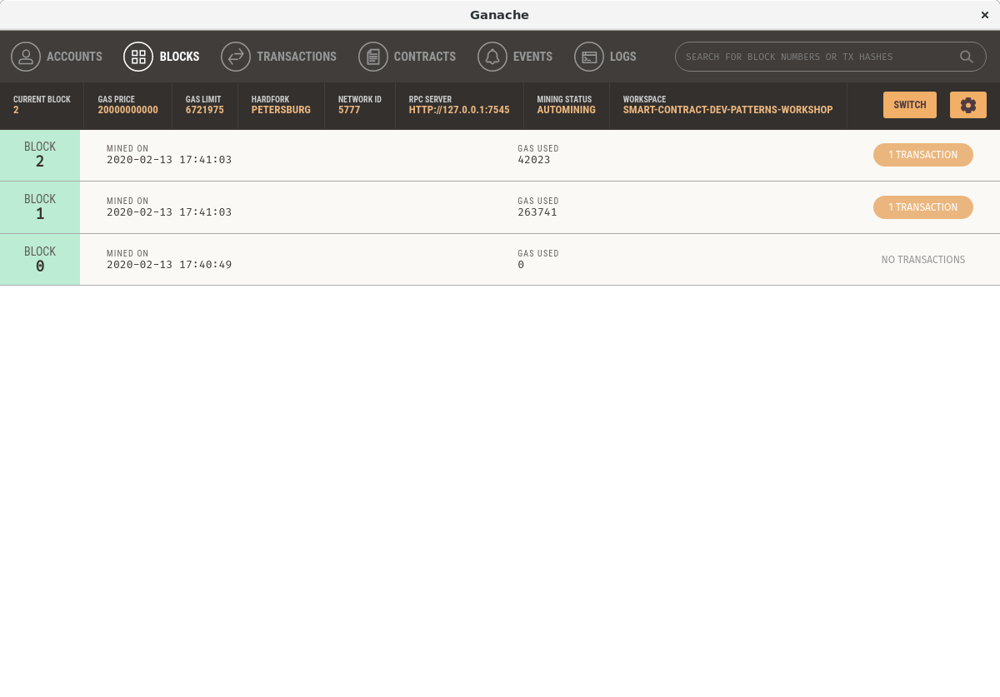

In the "Transactions" tab, you can see what each of those transactions are.
The first one was for the contract creation,
and the second one was an interaction with that contract.
Note that Ganache displays them in reverse chronological order,
meaning that the first (or oldest) transaction is at the bottom,
and the last (or most recent) transaction is at the top.

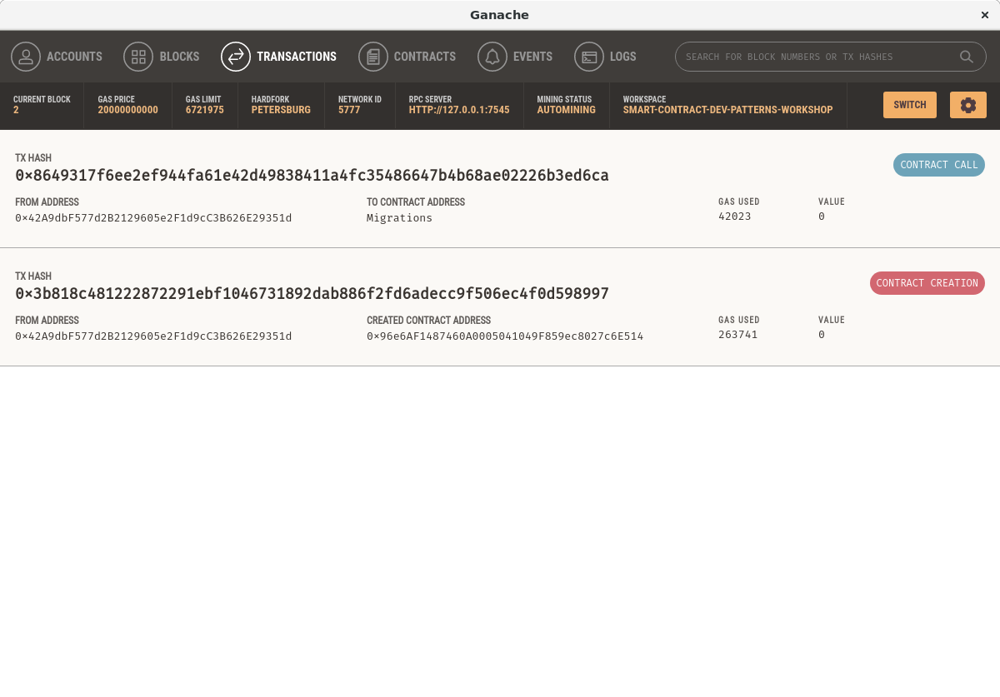

You can click on each transaction to see more details.

The **first transaction** is for contract creation.
You can see all the parameters of the transaction in this screen,
but the most important one is "Create Contract Address".
In order for a DApp to invoke functions on a smart contract,
it needs to have 2 things:

- An Application Binary Interface (ABI)
- The address of the smart contract

Thankfully truffle keeps track of both for us.
We will take a look at that shortly.

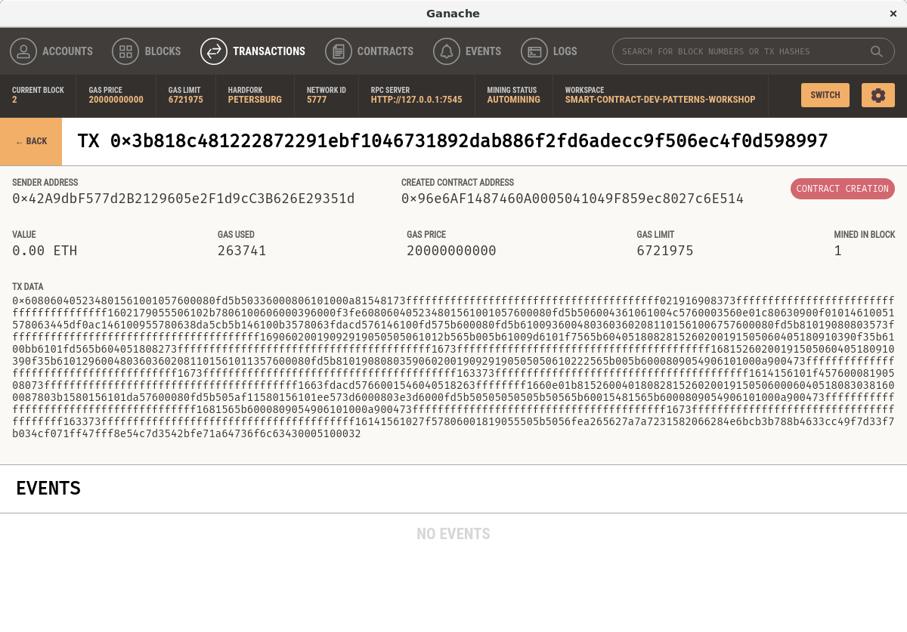

The **second transaction** is for an interaction with the contract.
You can see all the parameters of the transaction in this screen,
but the most important ones are "Function", and "Inputs".
This shows exactly what actions were performed on the smart contract.

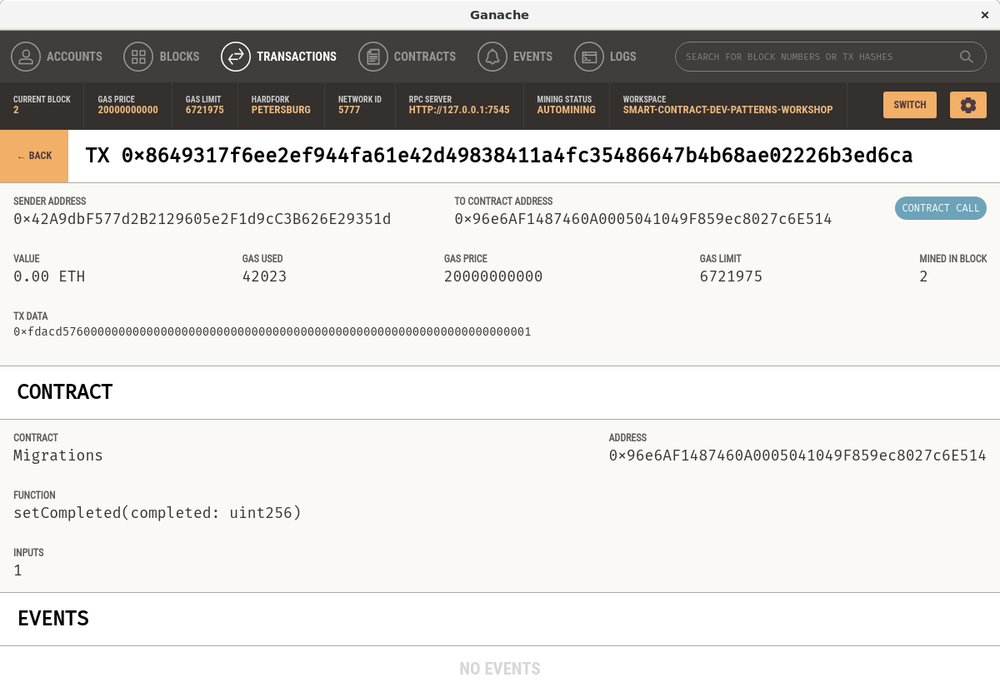

Recall earlier when we looked at the create contract transaction?
Open `build/contracts/Migrations.json`.
This file is what Truffle creates to keep track of the contracts which
it compiles and deploys.

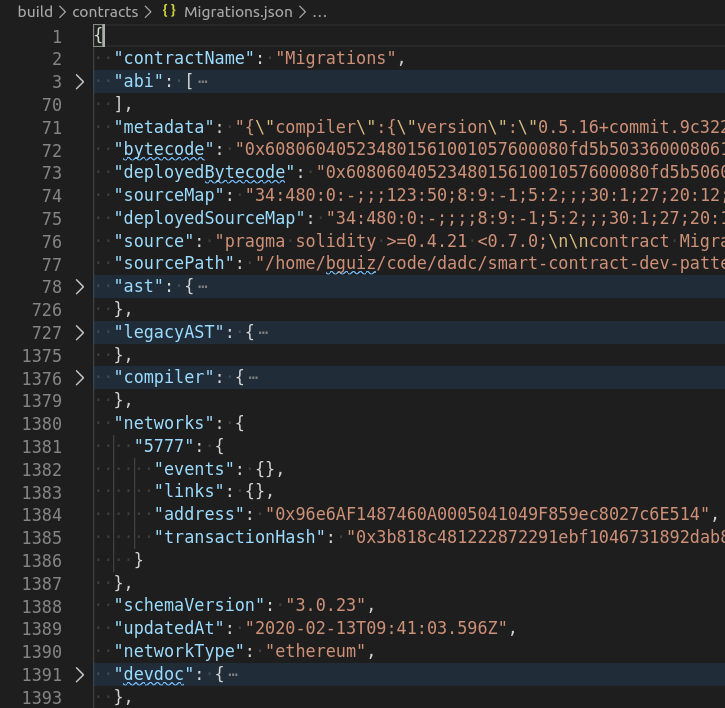

- You should see a key named `abi`,
  its value is the Application Binary Interface.
- You should also see a key named `bytecode`,
  its value is the EVM bytecode output by `solc`, the Solidity compiler;
  and you may verify that it matches the "Tx Data" value you see in Ganache.
- You should also see a key named `deployedBytecode`,
  its value is the the EVM bytecode that is stored on the blockchain,
  the code that actually executes.
- You should also be able to drill down into the key `networks['5777'].address`,
  its value is the contract address;
  and you may verify that it matches the "Created Contract Address" value you see in Ganache.

In this workshop, we do not intend to delve any further into the internals
of what Truffle does.
The intent of looking inside this file generated by Truffle
is to point out the connection between what is displayed in Ganache,
and what has been recorded by Truffle.
This may come in handy to know when debugging smart contract deployments.

We have taken a slight detour off of Ganache into Truffle,
so let's get back on track.

In the "Contracts" tab, we can see the list of contracts that have been deployed.
There should only be one at the moment.

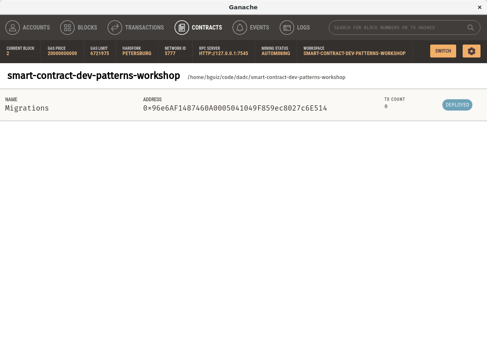

You can click on the contract to look at its details.
This shows the the contract's "Storage" (state variables),
"Transactions", and "Events".
At the moment, there should be two fields under "Storage".

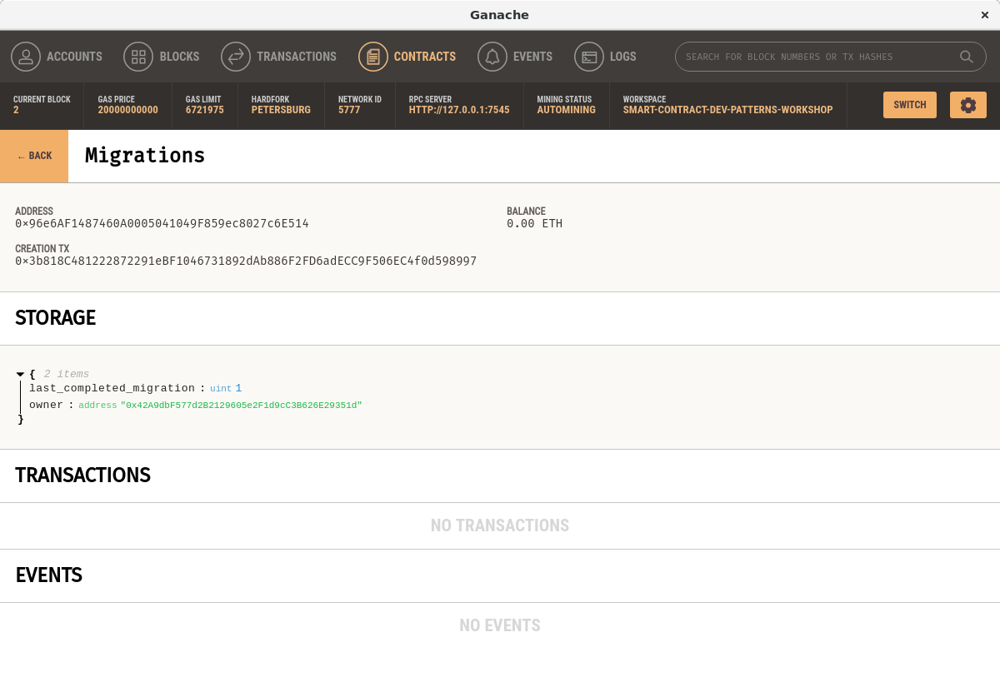

In the "Events" tab, events are displayed.
Since our lone contract has not emitted any events,
this is empty at the moment.

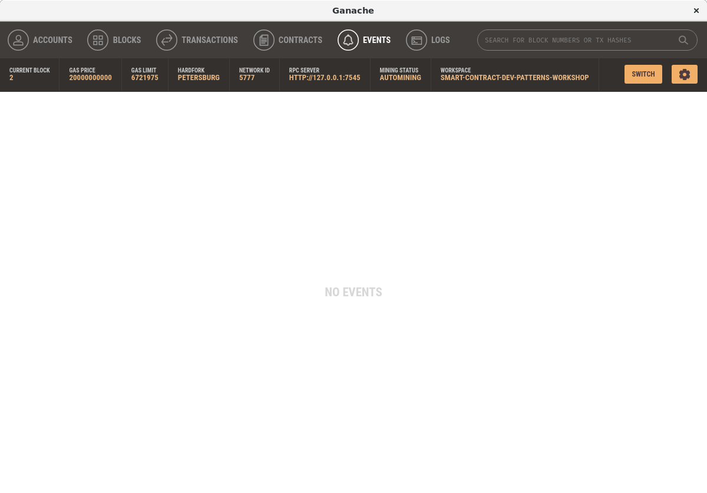

In the "Logs" tab, we see the low-level log output
from Ganache.
This mostly shows when various RPC calls are made,
and is otherwise quite uninteresting.
This may be of interest when something goes wrong,
and you need to find/ trace errors.

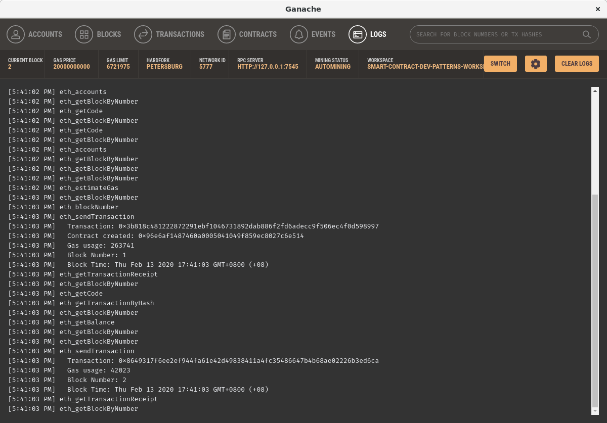

### Version control for this step

Don't forget to commit and push these changes to the git remote!

```bash
git add contracts/Migrations.sol migrations/1_initial_migration.js
git commit -m "proj: truffle init migrations"
git tag -a step-01-05 $( git rev-parse HEAD ) -m "step-01-05"
git push origin master --tags

```

Note that the `build` folder is `.gitignore`d,
and that we do not intend to commit that.

## More steps

TODO

...

## Quick Links

This workshop is part of a series:

- [Start here](../01-start-here/) &hellip; You are here.
- [Ownable](../02-ownable/)
- [Pausable](../03-pausable/)
- [Non-fungible token](../04-non-fungible-token/)
