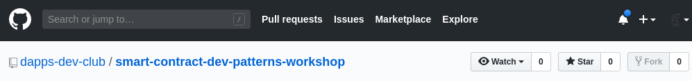
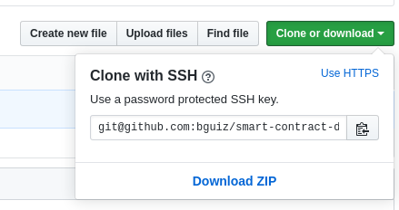
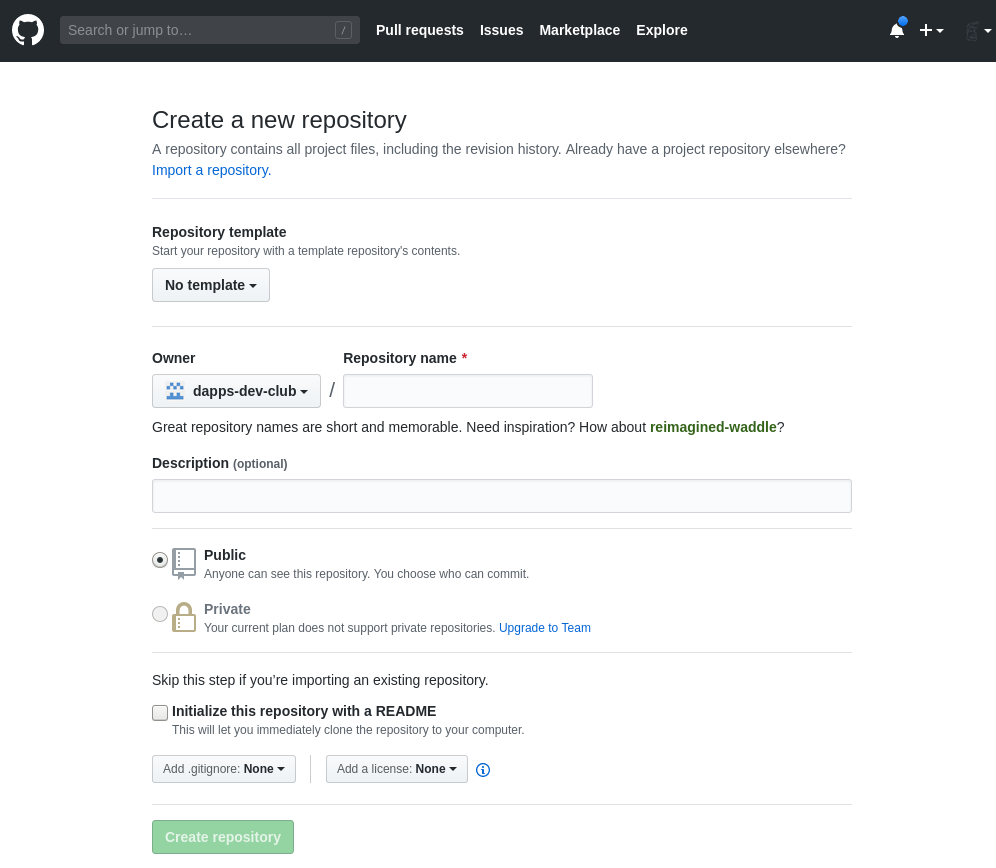
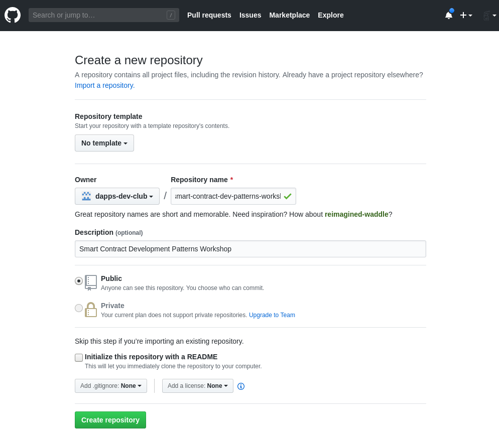
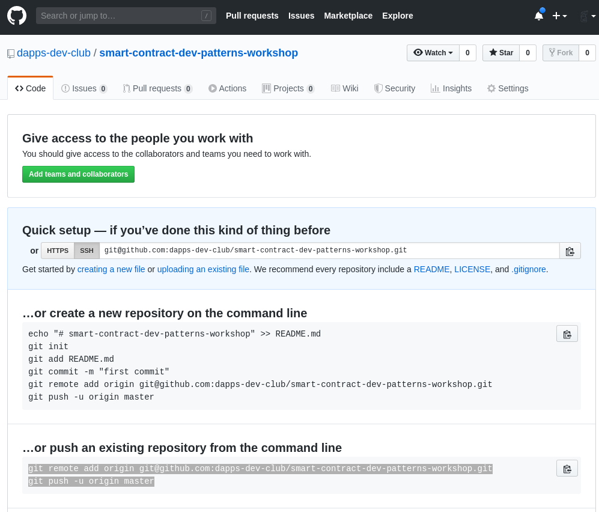

WIP!

## Pre-requsites

- A Github account
- SSH keys set up, and authorised in your Github account
- NodeJs set up, version `10.*`
  - Use [nvm](https://github.com/nvm-sh/nvm) to install/ manage multiple versions if necessary
- Ganache installed, version `2.1.*`
- A POSIX compliant shell or terminal
  - Linux: Your default terminal is OK
  - Mac OSX: Your default terminal is OK
  - Windows: `cmd` is **not OK**; need to install something else `git-terminal` or `WSL/2` instead

## Create a git repository

You have 2 options.
The quick way is to fork the demo repository.
The not-so-quick way is to set it up from scratch.
Both sets of instructions have been provided for your reference.

### Fork demo repository

Visit https://github.com/dapps-dev-club/smart-contract-dev-patterns-workshop and press the "Fork" button.



You should now see ...

- Click "clone or download"
- Select "clone with SSH" (you must be logged in, and have SSH keys set up)
- Copy the git url



```bash
git clone git@github.com:${YOUR_GITHUB_USERNAME}/smart-contract-dev-patterns-workshop.git

```

We roll back our local copy to the very first commit,
which which can reference by the handy tag name `step-01-01`.

```bash
git reset --hard step-01-01
```

Ensure the git remote repository (on github) has rolled back too,
to match your local git repository (on your computer).

```bash
git push -f origin master

```

### From scratch

```bash
# initialise the project
mkdir smart-contract-dev-patterns-workshop
cd smart-contract-dev-patterns-workshop
touch README.md
```

Edit your `README.md` file to add a basic description.
You may use the following, modify as you see fit:

```markdown
# Smart Contract Development Patterns Workshop

This is a **work in progress**.
Please check back here later!

## Instructions

Instructions are available
[here](http://dappsdev.org/hands-on/smart-contract-dev-patterns/).

## Author

[Brendan Graetz](http://bguiz.com/)

## Licence

GPL-3.0

```

```bash
git init
git add README.md
git commit -m "docs: add README"
git tag -a step-01-01 $( git rev-parse HEAD ) -m "step-01-01"
```

Note that `git rev-parse HEAD` simply returns the git commit hash for
the most recent commit, that you just created.

Visit `https://github.com/${YOUR_GITHUB_USERNAME}/repositories/new`

For example: https://github.com/organizations/dapps-dev-club/repositories/new



Fill in fields ...



Copy the commands at the bottom of the page ...



```bash
git remote add origin git@github.com:${YOUR_GITHUB_USERNAME}/smart-contract-dev-patterns-workshop.git
git push -u origin master
```

Refresh your project's page on github,
you should see your first commit there.

## Initialise a NodeJs project

If you are familiar with NodeJs development,
feel free to skip to the next section.

### Install dependencies

```bash
# set up npm and node packages
npm init -f
npm i --save-dev "@openzeppelin/test-helpers@0.5.4"
npm i --save-dev "solc@0.5.16"
npm i --save-dev "truffle@5.1.11"
npm i --save "@openzeppelin/contracts@2.5.0"

```

Note that, at this point, we do not need all of these dependencies yet.
We will make use of them at a later stage in this series of workshops.

At this point, you should have a `package.json` file
whose contents are similar to:

```json
{
  "name": "smart-contract-dev-patterns-workshop",
  "version": "0.0.0",
  "private": true,
  "description": "Smart Contract Development Patterns Workshop",
  "main": "contracts/Bolsilmon.sol",
  "directories": {
    "test": "test"
  },
  "repository": {
    "type": "git",
    "url": "git+https://github.com/dapps-dev-club/smart-contract-dev-patterns-workshop.git"
  },
  "keywords": [
    "solidity",
    "smart contracts",
    "development patterns",
    "workshop"
  ],
  "author": "bguiz",
  "license": "GPL-3.0",
  "bugs": {
    "url": "https://github.com/dapps-dev-club/smart-contract-dev-patterns-workshop/issues"
  },
  "homepage": "https://github.com/dapps-dev-club/smart-contract-dev-patterns-workshop#readme",
  "devDependencies": {
    "@openzeppelin/test-helpers": "0.5.4",
    "solc": "0.5.16",
    "truffle": "5.1.11"
  },
  "dependencies": {
    "@openzeppelin/contracts": "2.5.0"
  }
}

```

### Git ignore

Tell git to ignore the folder full of dependencies installed by npm,
as well as the build output from Truffle.

```bash
touch .gitignore

```

Edit the `.gitignore` file to have the following files:

```
/node_modules
/build

```

Don't forget to commit and push these changes to the git remote!

```bash
git add .
git status
git commit -m "proj: npm init + add dependencies + .gitignore"
git tag -a step-01-02 $( git rev-parse HEAD ) -m "step-01-02"
git push origin master

```

You will notice, in the output of `git add .` that in addition to
`package.json` and `.gitignore`, the two files that you explicitly created,
there also exists another file, `package-lock.json`.
This is automatically generated by npm.

## Run scripts

For your convenience, it is a good idea to define some run scripts.
This will save you from having to recall and type commands that you
are likely to use frequently during development.

```json
  "scripts": {
    "info": "echo $npm_package_name $npm_package_version && truffle version && which truffle",
    "compile": "truffle compile",
    "deploy": "truffle migrate",
    "clean-and-deploy": "truffle migrate --reset",
    "test": "truffle test"
  },

```

Don't forget to commit and push these changes to the git remote!

```bash
git add -p
git commit -m "proj: npm run scripts"
git tag -a step-01-03 $( git rev-parse HEAD ) -m "step-01-03"
git push origin master

```

### Side note: Git add modes

Note that in this case, instead of adding whole files using `git add`,
we added "hunks" (parts) of a file using `git add -p`.
(This is the same as `git add --patch`.)
This displays an interactive prompt for each "hunk" within a file
that differs from its previously committed version.
This gives you the opportunity to:

- Review the changes in more granular detail
- Commit, if you so choose, a subset of the changes per file instead of all changes in a file

The terminal output should look similar to:

```bash
$ git add -p
diff --git a/package.json b/package.json
index 7282adf..66d63cc 100644
--- a/package.json
+++ b/package.json
@@ -7,6 +7,13 @@
   "directories": {
     "test": "test"
   },
+  "scripts": {
+    "info": "echo $npm_package_name $npm_package_version && truffle version && which truffle",
+    "compile": "truffle compile",
+    "deploy": "truffle migrate",
+    "clean-and-deploy": "truffle migrate --reset",
+    "test": "truffle test"
+  },
   "repository": {
     "type": "git",
     "url": "git+https://github.com/dapps-dev-club/smart-contract-dev-patterns-workshop.git"
Stage this hunk [y,n,q,a,d,e,?]? y

$

```

Since there is only 1 "hunk" from 1 file in the `git diff`,
this command is a little overkill.
However, it may come in handy when following along with subsequent parts of this workshop.

You can read more about `git add --patch`,
and its close relative `git add --interactive`,
at this article on [git interactive staging](https://git-scm.com/book/en/v2/Git-Tools-Interactive-Staging).

## More steps

TODO

...

## Quick Links

This workshop is part of a series:

- [Start here](../01-start-here/) &hellip; You are here.
- [Ownable](../02-ownable/)
- [Pausable](../03-pausable/)
- [Non-fungible token](../04-non-fungible-token/)
