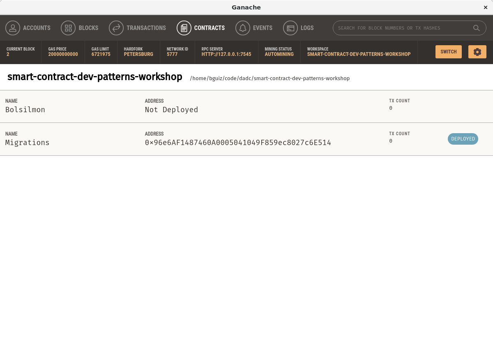
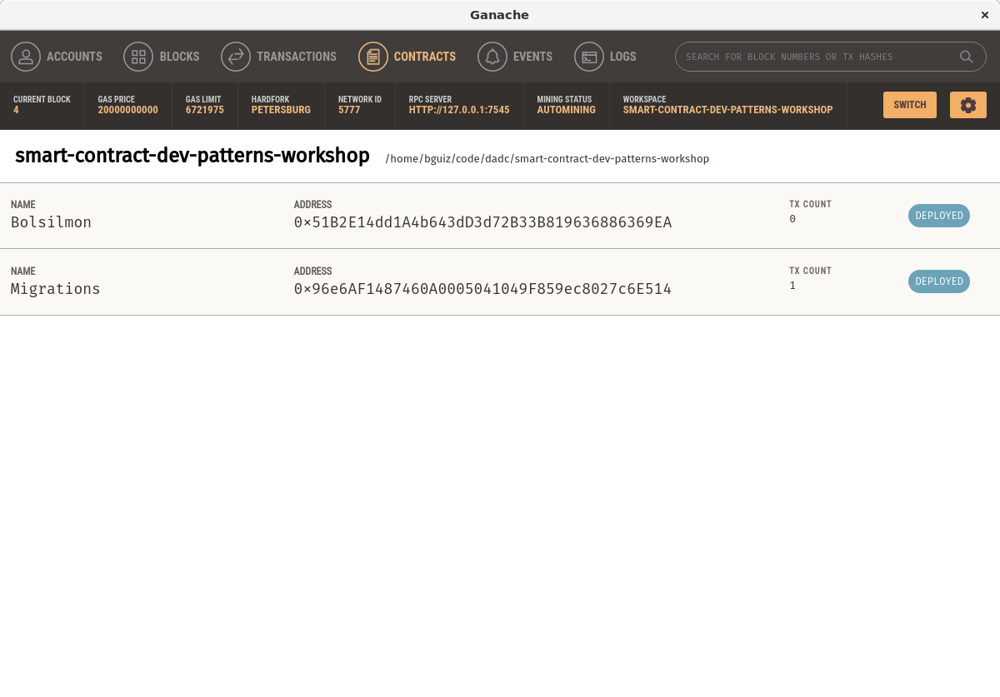

WIP!

## Recap

In the previous workshop, we set up a project using
npm, Truffle, and Ganache.
Thus far, we have only had one default smart contract,
generated by Truffle.

In this workshop, we will create our own smart contract,
which will be the "base contract" used during the remainder
of the workshops in this series.

## Design specifications

Here are the design specifications for this smart contract.

- Name: Bolsillo Monstruos
- Each account can create a **Mon** in a 2 step process
  1. Create the Mon with a random "seed" for its genes. This account must pay an amount to the smart contract do so.
  2. Birth the Mon that was created earlier, after waiting a certain amount of time. The wait is to ensure randomisation of the new Mon's genes.
- Two accounts can reproduce Mons that they own, in a 2 step process
  1. The initiator account can send a "mate request" to the acceptor account. The initiating account must pay an amount to the smart contract do so.
  2. The acceptor account may then either accept or reject this mate request.
    - The acceptor rejects: The mate request is forgotten, and a partial amount previously paid by the initiator is paid to the acceptor, with the smart contract retaining the remainder.
    - The acceptor accepts: After waiting a certain amount of time. The genes of the initiator's Mon and the acceptor's Mon are spliced together, in a manner inspired by DNA in biology, and creates + births a new Mon that probabilistically has half of each of its parent Mons' genes. The wait is to ensure randomisation of the splicing process. The mate request is is fulfilled, and a partial amount previously paid by the initiator is paid to the acceptor, with the smart contract retaining the remainder
- This contract may designate an owner
  - The owner can withdraw funds stored by the smart contract
  - The owner can pause a subset of the functions of this smart contract
- One account may send a Mon that it owns to another account.

## Implementation plan

In this workshop, we will:

- Create a new smart contract, `Bolsilmon.sol`
- Create a Truffle deployment for the `Bolsilmon` smart contract
- Define a `struct` named `Mon` to represent each Mon
- Define mappings and related state variables to track the Mons' creations and births
- Define a `createMon` function for the first step in the Mon creation process
- Define a `birthMon` function for the second step in the Mon creation process
- Define a `struct` named `MonMate` to represent each mate request
- Define mappings and related state variables to track the mate requests
- Define a `mateRequest` function for the first step in the mate process, to be called by the initiator
- Define a `geneSplice` function to compute the randomised genes, for internal use in the mate process
- Define a `mateAccept` function for the second step in the mate process, to be called by the acceptor
- Define a `mateReject` function for the alternative second step in the mate process, to be called by the acceptor
- Define an `ownerWithdrawal` function that enables the fees collected by the smart contract to be withdrawn by its owner

In subsequent workshops, we will:

- Create a new smart contract, `Ownable.sol`
- This implements the `Ownable` pattern
  - Allows for ownership to be transferred, and accepted
  - Paves the way for future restrictions that certain function invocations may only be performed by its owner
- Modify the `Bolsilmon` contract to be `Ownable`
- Create a new smart contract, `Pausable.sol`
- This implements the `Pausable` pattern
  - Allows the owner, exclusively, toggle the paused state
  - Paves the way for future restrictions that certain functions invocations may only be performed by its owner
- Modify the `Bolsilmon` contract to be `Pausable`, which in turn is still `Ownable`
- Modify `Bolsilmon` to import `ERC721` from Open Zeppelin
- This implements the ERC721 non-fungible token specification
- Modify existing functions to represent Mons as non-fungible tokens, and enable them to be transferred between accounts

## General notes

- We will endeavour to test all code that is written by us thoroughly
- We will endeavour to to use best practices, and avoid common pitfalls
- This workshop will be the longest one, however, it introduces very few new concepts for those that have already completed the first series
- The subsequent workshops will be be short relative to this first one, however, they do introduce new concepts for those that have already completed the first series
- The chief intent with these workshops is educational, the developed solutions here are merely referential, and by no means should you consider them audited or ready for production/ mainnet deployment

## New smart contract

To create a new smart contract within a Truffle project,
we need to create not only the *smart contract*,
but also the *migration script* for it.

### Contract and migration files

We do so by creating an empty `.sol` file in the `contracts` folder,
and by making a copy of the existing file within the `migrations` folder.

```bash
touch contracts/Bolsilmon.sol
cp migrations/1_initial_migration.js migrations/2_bolsilmon.js
```

Edit the smart contract file to give it the following contents:

```solidity
pragma solidity 0.5.16;

contract Bolsilmon {
  constructor()
    public
  {
    // do nothing
  }
}

```

For the migrations file, you only need to replace all occurrences
of `Migrations` with `Bolsilmon`.

```diff
--- migrations/2_bolsilmon.js
+++ migrations/2_bolsilmon.js
@@ -1,5 +1,5 @@
-const Migrations = artifacts.require("Migrations");
+const Bolsilmon = artifacts.require("Bolsilmon");

 module.exports = function(deployer) {
-  deployer.deploy(Migrations);
+  deployer.deploy(Bolsilmon);
 };

```

### Compile empty contract

At this point you, have a smart contract that does absolutely nothing,
yet is a minimum viable one for deployment.

Let's go ahead and deploy it!

Execute `npm run compile`, and Truffle will run `solc`,
and you should see output similar to the following:

```bash
$ npm run compile

> smart-contract-dev-patterns-workshop@0.0.0 compile /home/bguiz/code/dadc/smart-contract-dev-patterns-workshop
> truffle compile


Compiling your contracts...
===========================
> Compiling ./contracts/Bolsilmon.sol
> Artifacts written to /home/bguiz/code/dadc/smart-contract-dev-patterns-workshop/build/contracts
> Compiled successfully using:
   - solc: 0.5.16+commit.9c3226ce.Emscripten.clang

```

You will notice that there is a new file,
`build/contracts/Bolsilmon.json`,
which is generated by Truffle.
Take a look in the "Contracts" tab of Ganache,
and you should see that `Migrations` has an address,
whereas `Bolsilmon` does not, because it has not been deployed yet.



### Deploy empty contract

Next, execute `npm run deploy`,
and Truffle will take this compiled contract,
and deploy it on the simulated blockchain running in Ganache.

You should see output similar to the following:

```bash
$ npm run deploy

> smart-contract-dev-patterns-workshop@0.0.0 deploy /home/bguiz/code/dadc/smart-contract-dev-patterns-workshop
> truffle migrate


Compiling your contracts...
===========================
> Everything is up to date, there is nothing to compile.


Starting migrations...
======================
> Network name:    'development'
> Network id:      5777
> Block gas limit: 0x6691b7


2_bolsilmon.js
==============

   Deploying 'Bolsilmon'
   ---------------------
   > transaction hash:    0xee340f6223f7057d38b4eed1a34af107f7bc55235fc9d2d9f08789bc4203dbe1
   > Blocks: 0            Seconds: 0
   > contract address:    0x51B2E14dd1A4b643dD3d72B33B819636886369EA
   > block number:        3
   > block timestamp:     1582010298
   > account:             0x42A9dbF577d2B2129605e2F1d9cC3B626E29351d
   > balance:             99.99245932
   > gas used:            71270
   > gas price:           20 gwei
   > value sent:          0 ETH
   > total cost:          0.0014254 ETH


   > Saving migration to chain.
   > Saving artifacts
   -------------------------------------
   > Total cost:           0.0014254 ETH


Summary
=======
> Total deployments:   1
> Final cost:          0.0014254 ETH

```

Commentary:

- See `Compiling your contracts` in the output.
  This is because Truffle checks if the deployed version is up to date.
  If it is not, it will automatically re-compile
  (and subsequently deploy this new copy, not the previously compiled version).
- See `Starting migrations` in the output.
  This is where your migrations script is run.
- See `Deploying 'Bolsilmon'` in the output.
  This is the result of the migration,
  showing the details of the deployment transaction.
  A smart contract deployment is a transaction,
  just like any other interaction with the blockchain.

Switch to Ganache, and look in the "Contracts" tab again.
This time you will notice that the the `Bolsilmon` smart contract
has indeed been deployed, and has an address.



### Version control for this step

Don't forget to commit and push these changes to the git remote!

```bash
git status
git add contracts/Bolsilmon.sol migrations/2_bolsilmon.js
git commit -m "feat: empty main contract with migration"
git tag -a step-02-01 $( git rev-parse HEAD ) -m "step-02-01"
git push origin master --tags

```

## Mon `struct`s and state variables

This smart contract needs to represent multiple Mons,
and therefore need to store data about all of them.
We will use `struct`s to model the state of an individual Mon,
and `uint256`s and `mapping`s to store the state of multiple Mons.

### Smart contract arrangement

Before we start with the above, a little housekeeping.
A little organisation up front paves the way for
easier to navigate code further along.

Modify `contracts/Bolsilmon.sol` to add the following comments:

```diff
--- contracts/Bolsilmon.sol
+++ contracts/Bolsilmon.sol
@@ -1,6 +1,15 @@
 pragma solidity 0.5.16;

 contract Bolsilmon {
+  // structs
+
+  // events
+
+  // state variables
+
+  // modifiers
+
+  // functions
   constructor()
     public
   {
```

In this workshop, we will be grouping the different elements
that the smart contract is comprised of by category:
`struct`, `event`, state variable, `modifier`, and `function`.
This makes it easier to find what we are looking for,
as we expect the size of this file to get quite large.

### The Mon struct

Under the section demarcated by `// structs`,
add the first one:

```solidity
  struct Mon {
    uint256 createBlock;
    bool born;
    bytes32 genes;
  }

```

Keep in mind that this point,
this smart contract does not yet store any state.
A `struct` merely defines a logical grouping
of state variables.

### A collection of Mons using state variables

Under the section demarcated by `// state variables`,
add these three:

```solidity
  uint256 public numMons = 0;
  mapping(uint256 => Mon) public mons;
  mapping(uint256 => address) public monCreators;

```

Using a combination of a `uint256` state variable
and a `mapping(uint256 => $STRUCT)` is a common pattern
used in Solidity for storing a collection of information.
This is what we have done with `numMons` and `mons`.

You may have noticed earlier that when we defined the `struct`,
it did not define a field named `address owner`.
If we had done this, when we have a Mon,
we can find out who its owner is by looking up a property:
e.g. `mon.owner`.

Instead, we have chosen to keep this information stored
in a separate `mapping` called `monCreators`.
This is done for a couple of reasons:

1. We would like to be able to look up a Mon's owner directly,
   without retrieving the full Mon `struct`.
2. This has implications at a later stage of the project,
   when we implement a non-fungible token standard,
   which may not be apparently just yet.
   We shall get to that in a later workshop.

At that this point, this smart contract does store some state.

Compile the smart contract to ensure that you have no compilation errors,
using `npm run compile`.
The output should be similar to the compile output we saw earlier.

### Version control for this step

Don't forget to commit and push these changes to the git remote!

```bash
git status
git add contracts/Bolsilmon.sol migrations/2_bolsilmon.js
git commit -m "feat: define struct and state vars to represent collection of Mons"
git tag -a step-02-02 $( git rev-parse HEAD ) -m "step-02-02"
git push origin master --tags

```

## Creating a new Mon

The `createMon` function will allow a user to
create a Mon with a random "seed" for its genes.
It expects the account to pay an amount to the smart contract
for the right to do so.
Since this function modifies the state,
we should also emit an event to notify any listener
the a state change has occurred.

Note that, as per the design,
the new Mon has not yet been *born*.
That will require a subsequent function call.

### Define a `createMon` function

Under `// functions` we already have the `constructor`.
Underneath that, add this new function:

```solidity
  function createMon(
    bytes32 geneSeed
  )
    public
    payable
    returns(uint256 monId)
  {
    monId = ++numMons;
    Mon memory newMon = Mon(
      block.number,
      false,
      geneSeed
    );
    mons[monId] = newMon;
    monCreators[monId] = msg.sender;
  }
```

Next, let us look through this one part at a time.

#### Function name

```solidity
  function createMon

```

This is the function's name -
`createMon`.

#### Function parameter list

```solidity
  (
    bytes32 geneSeed
  )

```

This is the function's parameter list -
it accepts one parameter named `geneSeed`,
whose type is `bytes32`.

#### Function modifier list

```solidity
    public
    payable

```

This is the function's modifier list -
it is both *public* and *payable*.
These are both built-in modifiers,
available from `solc`.
Custom modifiers (ones that you write yourself)
may also go here, if needed.

#### Function return types

```solidity
    returns(uint256 monId)
```

This is the function's return types -
it returns a single `uint256`.
Since the return type has been given a name, `monId`,
a variable with this name and type is available within
the scope of the function,
and its value at the point at which the function exits will be returned,
without the need for an explicit return statement.

#### Function body

```solidity  {
    monId = ++numMons;
    Mon memory newMon = Mon(
      block.number,
      false,
      geneSeed
    );
    mons[monId] = newMon;
    monCreators[monId] = msg.sender;
  }

```

This is the function's body.
The code that appears between the opening `{`
and the closing `}` will have access to
the parameters of the function,
the state variables of this smart contract,
and the "return variable" (mentioned above).
It also has the ability to call any functions
in this smart contract that are have a modifier of
`public`, `internal`, and private;
but may not call any functions with an `external` modifier.

#### Function as a whole

What does this function actually do?

1. It takes an input of 32 bytes, representing a seed used to initialise the genes for the new Mon.
2. It increments the `numMons` state variable by 1, and uses this as the ID of the new Mon about to be created.
    ```solidity
        monId = ++numMons;

    ```
3. It creates a new `struct` representing a Mon, containing the current block number, a boolean flag to indicate that the Mon is not yet born, and the gene seed from the input.
    ```solidity
      Mon memory newMon = Mon(
        block.number,
        false,
        geneSeed
      );

    ```
4. It stores the new Mon's data within the `mons` `mapping`, and stores the owner of the Mon in the `monCreators` `mapping`.
    ```solidity
        mons[monId] = newMon;
        monCreators[monId] = msg.sender;

    ```
5. It returns an output of unsigned integer, representing the ID of the newly created Mon.

Note that `msg.sender` is the address of the account that calls a function.
This is a special variable built into Solidity by its compiler.
See [Solidity's documentation on block and transaction properties](https://solidity.readthedocs.io/en/v0.5.15/units-and-global-variables.html#block-and-transaction-properties).

This function is not quite complete yet, however.
We need to define a couple of new things outside of this function,
before we come back to it and complete it.

Read more:
[Solidity documentation of functions](https://solidity.readthedocs.io/en/v0.5.15/contracts.html#functions)

### Define a `MonCreate` event

Under `// events`, add the following:

```solidity
  event MonCreate (
    uint256 indexed monId,
    address indexed owner
  );

```

This simply means that there is now an `event` with the name `MonCreate`,
and it has two fields, and unsigned integer, and an address.

The `indexed` keyword here indicates that the events are emitted
in such a manner that they may be searched using those fields.
As this comes at a higher cost, there is a limit of three such fields.
See [Solidity's documentation on events](https://solidity.readthedocs.io/en/v0.5.15/contracts.html#events).

### Define a `minPayment` modifier

Under `// modifiers`, add the following:

```solidity
  modifier minPayment(
    uint256 amount
  ) {
    require(
      msg.value > createPrice,
      "You need to pay more"
    );
    _;
  }

```

This creates a modifier, which looks very similar to a function.
The main distinction is the `_;` which indicates a placeholder
for further code execution.
When a function specifies that it uses a particular modifier,
that modifier's code is executed,
and where the `_;` appears, the function's code is executed.

In the case of this modifier,
since the `_;` appears at the bottom of the modifier,
it means that the modifier's code runs *before*
the function's code.

What does this modifier actually do?
It runs a single `require` statement,
which will throw (and therefore prevent the function from executing),
when the amount sent together with the transaction (`msg.value`),
is less than the amount specified in the parameter.

Read more:
[Solidity documentation for function modifiers](https://solidity.readthedocs.io/en/v0.5.15/contracts.html#function-modifiers)

### Modify `monCreate` to ensure minimum payment

Under `// state variables`, add the following:

```solidity
  uint256 public createPrice = 0.1 ether;

```

This creates a state variable, which we will use shortly.

Next, we add the modifier to the `createMon` function.
The top part of the function should now look like this:

```solidity
  function createMon(
    bytes32 geneSeed
  )
    external
    payable
    minPayment(createPrice)
    returns(uint256 monId)
  {

```

The part just added was `minPayment(createPrice)`.
This makes the `createMon` function use
the `minPayment` modifier that we have just defined above.
The `amount` parameter sent to the modifier is the value of `createPrice`,
which is a state variable in this smart contract.
Tracing these values, the end effect of this is that
the `createMon` function will not run unless
the transaction in which it is invoked sends (`msg.value`)
at least *0.1 ether* (`createPrice`) along with it.

### Modify `monCreate` to emit an event

We also add the event to the `monCreate` event.
This time, it should be at the bottom of the function.

```solidity
    emit MonCreate(
      monId,
      msg.sender
    );

```

Any clients that are listening to events emitted by this smart contract
may now learn about the creation on new Mons,
without polling (querying at regular intervals).

Read more:
[Solidity documentation for events](https://solidity.readthedocs.io/en/v0.5.15/contracts.html#events).

### Version control for this step

Don't forget to commit and push these changes to the git remote!

```bash
git status
git add contracts/Bolsilmon.sol
git commit -m "feat: createMon function, minPayment modifier, and MonCreate event"
git tag -a step-02-03 $( git rev-parse HEAD ) -m "step-02-03"
git push origin master --tags

```

## Testing smart contract initialisation

One of Truffle's most useful features is that it provides
a built in testing framework for your smart contracts.
Any contracts that can be compiled and deployed successfully
may be tested.

Truffle did not re-invent the wheel with its own test framework,
but instead builds upon one of the most popular
Javascript test frameworks: [Mocha](https://mochajs.org/).
So if you have previously written tests for a Javascript project,
this will feel very familiar.

Specifically, if you have used Mocha before,
the two syntactic differences that you will notice are that:

1. You can use a `contract` block in place of `describe` block.
   You are still free to use describe blocks for grouping.
2. The first parameter of the `contract` block's callback function
   is an array of account addresses.
   The state of the smart contracts being tested remain intact
   across multiple tests within the `contract` block,
   but are reset between one `contract` block and the next.

Apart from these,
all other syntax is the same as the standard Mocha framework.

There is also a major non-syntactical difference between
standard Mocha and Truffle's Mocha.
With standard Mocha, you are free to write tests at any level:
Unit tests, integration tests, acceptance tests.
With Truffle's Mocha, all tests are acceptance tests,
as they are run against copies of the smart contracts
that are deployed on a blockchain (Ganache).
This distinction may appear superfluous at first,
but will become apparent later on,
for example, it influences how we can mock smart contracts.

### Writing your first test

```bash
mkdir -p test/Bolsilmon
touch test/Bolsilmon/00-init.spec.js

```

Open up `test/Bolsilmon/00-init.spec.js` in your code editor,
and add the following contents:

```javascript
const assert = require('assert');

const Bolsilmon = artifacts.require('Bolsilmon');

contract('Bolsilmon - initial state', () => {
  it('should initialise', async () => {
    assert.doesNotThrow(async () => {
      await Bolsilmon.deployed();
    });
  });
});

```

Let us take a look at this bit by bit.

### Assertions

```javascript
const assert = require('assert');

```

This is not an external library, but rather the built in
[`assert` module](https://nodejs.org/api/assert.html)
that comes with NodeJs core.
Most Javascript test frameworks do not have a built-in assertions library,
opting instead to leave you to import your own choice.
The [Chai](https://www.chaijs.com/) assertions library is
a very popular choice among developers using Mocha as the test framework.
Who would have thought that **café con chocolate**
goes well with **té con especias**? 😂

Anyway, for the purposes of keeping the surface area of
this workshop as small as possible,
we will not be using Chai, or any other assertions library.
The built in `assert` works just fine for our pruposes.

### Smart contract Javascript representation

We have written the smart contract in Solidity,
but need to interact with it in Javascript,
since that is how we're writing our tests.

Thankfully this is done really easily, as we have web3.js.
When developing the front end of an in-browser DApp,
you are likely to use web3.js.
Among other things, you can pass it
the address at which as smart contract is deployed,
and its application binary interface (ABI),
and it will return a Javascript object
that abstracts the low-level code required to
interact with the smart contract.

In the
[previous workshop](../01-start-here/ "Start here - Smart Contract Development Patterns"),
we observed that after we compiled and deployed smart contracts,
they appeared in `build/contracts/*.json`.
For example, take a look at `build/contracts/Bolsilmon.json`
to see what Truffle has stored for our main contract.


```javascript
const Bolsilmon = artifacts.require('Bolsilmon');

```

The global variable `artifacts` is made available by Truffle,
and `artifacts.require()` loads information about smart contracts
that are stored in `build/contracts/*.json`,
including, critically, its deployed address, and ABI.
It then wraps this with web3.js and adds its own Truffle wrapper,
giving you a copy of your smart contract ready for use within
Javascript tests.

> Note: Please do not confuse `artifacts.require()` with
> the `require()` that is from NodeJs core - they are not the same.

### The `contract` block

As mentioned earlier, the `contract` block in Truffle's Mocha
is similar to the `describe` block in standard Mocha.
It is used to group similar tests together.p of tests.

```solidity
contract('Bolsilmon - initial state', (accounts) => {
  // `it` blocks go here
});

```

- Its first parameter is a string,
representing the name or description for this group of tests.
- Its second parameter is a callback function,
within which all the tests go.
In standard Mocha, the callback function does **not**
have any parameters of its own, however,
in Truffle's Mocha callback function has one parameter,
which is an array of accounts.

> Note: When we don't need accounts in any of the tests within
> the `describe` block, we can omit the `accounts` a parameter.

### The `it` block

The `it` block in standard Mocha, is the same as
the `it` block in Truffle's Mocha.

```javascript
  it('should initialise', async () => {
    // assertions go here
  });

```

- Its first parameter is a string,
representing the name or description for this particular test.
- Its second parameter is a callback function,
within which any assertions should go.

> Note: The callback function technically can be `async` or not.
> However, many operations on smart contract are asynchronous,
> as they have to interact with a blockchain via RPC.
> Thus, virtually all tests need to be `async`.

### A test assertion

The
[`assert.doesNotThrow`](https://nodejs.org/api/assert.html#assert_assert_doesnotthrow_fn_error_message)
method throws an error if the function does indeed throw.

We use that to check if we get any errors when creating an instance
of a deployed contract, like so:

```javascript
    assert.doesNotThrow(async () => {
      await Bolsilmon.deployed();
    });

```

The statement `await Bolsilmon.deployed();` should not error,
because we have already compiled and deployed this smart contract.
This is a test which we expect to fail only in exceptional circumstances.
For example, if you were to manually edit `build/contracts/Bolsilmon.json`
and change the value of the deployed address (`networks['5777'].address`).

Thus, this test is a little bit pointless,
but it serves as an easy "first test",
and serves well for demonstrating the process of testing a smart contract.

### Running tests and looking at output

The command `npm t` is shorthand for `npm run test`,
which in turn runs `truffle test`.
Upon running it, you should get output similar to the following:

```bash
$ npm t

> smart-contract-dev-patterns-workshop@0.0.0 test /home/bguiz/code/dadc/smart-contract-dev-patterns-workshop
> truffle test

Using network 'development'.


Compiling your contracts...
===========================
> Everything is up to date, there is nothing to compile.


  Contract: Bolsilmon - initial state
    ✓ should initialise


  1 passing (23ms)

```

This shows you the name/ description of the `contract` block,
and underneath it, indented, the name/ description of the `it` block.
Right at the bottom, there is a summary,
showing that the one and only test has passed.

### A note on test driven development

[Test driven development](https://en.wikipedia.org/wiki/Test-driven_development)
(TDD) is an approach that is often used in software engineering,
which requires the developer to write tests prior to
implementing the parts of the application that meet the test criteria.

In these workshops, however, we will not be taking that approach,
and instead progress using a development cycle where
we implement something prior to writing tests for it.

TDD is indeed a valid approach toward software engineering,
and there is nothing particular to smart contracts which prevent this.
I would encourage those among you who would like to
follow along these workshops while adhering to the TDD approach
to do so by simply skipping ahead to the steps involving tests,
and then jumping back to the implementation as appropriate.
That would accommodate the main aspect of TDD,
and other aspects of it are left as an exercise for you.

With that said, let's continue writing more tests!

### Writing happy path tests

In a typical set of tests for a smart contract,
you would typically have both "happy path" tests and "failure path" tests.
Happy path tests are when an interaction is successful.
Failure path tests are when when an interaction is unsuccessful.
Since failure path tests typically **do not** modify state,
whereas happy paths tests **do** modify state,
is is common to write the failure path tests first,
and then write the happy path tests.

In this particular case, there is no possible failure path
for the intialisation of this smart contract -
note that the constructor currently does not do anything -
and thus we do not have any failure paths tests to write.
We will skip ahead to writing a happy path test,
that checks/ verifies the initial state of the smart contract.

```javascript
  it('initial state', async () => {
    const inst = await Bolsilmon.deployed();

    const numMons = await inst.numMons.call();

    assert.equal(numMons.toString(), '0',
      'Unexpected numMons initial value');
  });

```

Let us look at this part by part.

#### Get contract instance

At the beginning of each `it` block,
If there are multiple `it` blocks within the same `contract` block
we obtain an instance of the smart contract.

```javascript
    const inst = await Bolsilmon.deployed();

```

#### Query smart contract state

Let us query all of the `uint256` state variables
that are stored in this smart contract:

```bash
    const numMons = await inst.numMons.call();

```

The code `await inst.SOME_VARIABLE_NAME.call()`,
queries the smart contract for a primitive value.
However, it makes this query on a local copy,
thus resulting in no transaction being recorded on the blockchain.

For non-primitive values,
[`mapping`](https://solidity.readthedocs.io/en/v0.5.15/types.html#mapping-types) and
[`array`](https://solidity.readthedocs.io/en/v0.5.15/types.html#arrays),
simply add the key that you wish to look up as the parameter of `.call()`.
For example:

```javascript
    const mon = await inst.mons.call(new BN(1));

```

The above would query the `mons` `mapping`,
and return the Mon at key `1`.

At this point however, the mappings are empty,
and there is no point in querying them.
So we are not going to do that within this test.

> Note: `BN` is a big number utility library,
> which we have yet to introduce at this point.
> We shall get to that later.

#### Assert smart contract state

Now that we have obtained the variables we want,
we may proceed to check that their values
do indeed match with their expected value.

```javascript
    assert.equal(numMons.toString(), '0',
      'Unexpected numMons initial value');
```

We are using
[`assert.equal`](https://nodejs.org/api/assert.html#assert_assert_equal_actual_expected_message),
which uses the following parameters:

1. Actual value.
   The value that is obtained from the system under test,
   which is the smart contract in this case.
2. Expected value.
   The value which the system under test should have,
   determined to be "correct" by the developer.
3. Error message - Optional.
   Text to include in the error that is thrown if actual value and expected value are not the same.

> Note: The actual values here are `BN`s,
> and thus cannot be compared with regular Javascript `Number`s directly.
> Thus the actual values are converted to `String`s using `.toString()`,
> and expected values are numbers that are quoted `String` literals.

### Re-running tests and looking at output

We have just completed writing our very first tests
for this smart contract,
which check that has been deployed,
and that its initial values are what expect them to be
prior to any function calls.

We re-run the tests, using the same `npm t` command.

```bash
$ npm t

> smart-contract-dev-patterns-workshop@0.0.0 test /home/bguiz/code/dadc/smart-contract-dev-patterns-workshop
> truffle test

Using network 'development'.


Compiling your contracts...
===========================
> Everything is up to date, there is nothing to compile.


  Contract: Bolsilmon - initial state
    ✓ should initialise
    ✓ initial state


  2 passing (43ms)

```

The output should be almost the same as the previous time we ran the tests.
The only difference is that there is an extra line: `✓ initial state`.
Also, the final line should indicate that there are now two tests.

### Version control for this step

Don't forget to commit and push these changes to the git remote!

```bash
git status
git add contracts/Bolsilmon.sol migrations/2_bolsilmon.js
git commit -m "test: for main contract initialisation"
git tag -a step-02-04 $( git rev-parse HEAD ) -m "step-02-04"
git push origin master --tags

```

## Testing the `createMon` function

Previously, we have written some tests for the initial state of the smart contract.
Now let's write some tests for the function that we have implemented, `createMon`.
As a recap, let us take a look at its implementation,
through a test writing lens:

```solidity
  function createMon(
    bytes32 geneSeed
  )
    external
    payable
    minPayment(createPrice)
    returns(uint256 monId)
  {
    monId = ++numMons;
    Mon memory newMon = Mon(
      block.number,
      false,
      geneSeed
    );
    mons[monId] = newMon;
    monCreators[monId] = msg.sender;

    emit MonCreate(
      monId,
      msg.sender
    );
  }

```

- We should write a "failure path" test where we attempt to call the function,
  but do not pay enough for it.
- We should write a "happy path" test were we call the function successfully,
  and then assert the following:
  - `numMons` has increased by one
  - `mons` contains a new Mon
  - `monCreators` contains a new address
  - a `MonCreate` event was emitted

### Create a new test file

```bash
touch test/Bolsilmon/01-create-mon.spec.js

```

Open up `test/Bolsilmon/01-create-mon.spec.js` in your code editor,
and add the following contents:

```javascript
const assert = require('assert');

const Bolsilmon = artifacts.require('Bolsilmon');

contract('Bolsilmon - createMon', () => {
});

```

This is the same as how we started with the previous test file.

### Adding the Open Zeppelin test helpers library

When we were initialising the project, we installed a `devDependency`
named `@openzeppelin/test-helpers`.
We are going to make use of that in our tests now.

```javascript
const {
  BN,
  expectRevert,
  expectEvent,
} = require('@openzeppelin/test-helpers');

```

- `BN` is the big number library used in web3.js.
  This may be included within the web3.js library,
  but it is a library in its own right.
  Check out [BN.js documentation](https://github.com/indutny/bn.js/).
- `expectRevert` is a helper that allows us to assert when an attempted transaction
  errors, and is reverted by the smart contract.
  See [`expectRevert` documentation](https://docs.openzeppelin.com/test-helpers/0.5/api#expect-revert).
- `expectEvent` is a helper that allows us to assert that a transaction
  emits an event of with the expected values.
  See [`expectEvent` documentation](https://docs.openzeppelin.com/test-helpers/0.5/api#expect-event).

We will put all of these into action shortly.

### Type conversion utilities

#### Converting hexadecimal string to bytes

Our `createMon` function expects us to pass in an input of type `bytes32`.
We can obtain that by expressing it as a string literal,
and then converting it using `hexToBytes`.

For example `web3.utils.hexToBytes('0xff')` will return a single byte
comprised of all `1`s.

See [`hexToBytes` documentation](https://web3js.readthedocs.io/en/v1.2.4/web3-utils.html#hextobytes).

#### Converting `ether` to `wei`

The `web3.utils.toWei` allows us to specify an amount of currency in any denomination (
common ones are `ether` and `gwei`),
and converts these to `wei`, which is the smallest possible denomination of currency.
It returns a `BN`, which is what web.js uses for all its numeric values.

For example, `web3.utils.toWei('0.09', 'ether')` returns a `BN` that represents
`0.09 * 10^18`, which would be a nine with 16 zeroes after it.

See [`toWei` documentation](https://web3js.readthedocs.io/en/v1.2.4/web3-utils.html#towei).

### Extract accounts in `contract` block

In the contract block, we currently have no parameters in the callback function.
We add one, named `accounts`,
and expect this to be an array of addresses.
We use array destructuring to extract the first address into `account1`.
The top part of the `contract` block should now look like this:

```javascript
contract('Bolsilmon - createMon', (accounts) => {
  const [
    account1,
  ] = accounts;

```

See [MDN documentation for array destructuring assignments](https://developer.mozilla.org/en-US/docs/Web/JavaScript/Reference/Operators/Destructuring_assignment#Array_destructuring).

### Define constants for use in tests

The gene seed that is used as an input may be shared across multiple tests,
so we will define it within the `contract` block.
We make use of `web3.utils.hexToBytes()` to convert it to the form
needed to interact with the smart contract.

```javascript
  const geneSeed =
    '0x0102030405060708090a0b0c0d0e0f100102030405060708090a0b0c0d0e0f10';
  const geneSeedBytes =
    web3.utils.hexToBytes(geneSeed);

```

### Write a failure path test

Now we are ready to write the first test for this `contract` block.
Create a new `it` block, like so:

```javascript
  it('should bar when not paying enough', async () => {
    const inst = await Bolsilmon.deployed();
  });

```

#### Perform function call that fails

Inside that `it` block, invoke the `createMon` function,
but **do not** pay enough as we want it to fail.

```javascript
    await inst.createMon(
      geneSeedBytes,
      {
        from: account1,
        value: web3.utils.toWei('0.09', 'ether'),
      },
    );

```

The `createMon` payment must be paid at least 0.1 ether,
which is enforced by the `minPayment` modifier.

#### Run the failing test

Run `npm t -- test/Bolsilmon/01-create-mon.spec.js`.
This is the same as `npm t`, except that only the tests within
that one file are run.
Any other tests - in this case, the ones in `test/Bolsilmon/00-init.spec.js` -
are not run at all.

This should produce output similar to the following:

```bash
$ npm t -- test/Bolsilmon/01-create-mon.spec.js

> smart-contract-dev-patterns-workshop@0.0.0 test /home/bguiz/code/dadc/smart-contract-dev-patterns-workshop
> truffle test "test/Bolsilmon/01-create-mon.spec.js"

Using network 'development'.


Compiling your contracts...
===========================
> Everything is up to date, there is nothing to compile.


  Contract: Bolsilmon - createMon
    1) should bar when not paying enough
    > No events were emitted


  0 passing (58ms)
  1 failing

  1) Contract: Bolsilmon - createMon
       should bar when not paying enough:
     Error: Returned error: VM Exception while processing transaction: revert You need to pay more -- Reason given: You need to pay more.
     at PromiEvent (node_modules/truffle/build/webpack:/packages/contract/lib/promievent.js:9:1)
      at TruffleContract.createMon (node_modules/truffle/build/webpack:/packages/contract/lib/execute.js:169:1)
      at Context.it (test/Bolsilmon/01-create-mon.spec.js:24:16)
      at process._tickCallback (internal/process/next_tick.js:68:7)


npm ERR! Test failed.  See above for more details.

```

In the summary you see that there is `1 failing` test,
in particular: `Contract: Bolsilmon - createMon` ➡️ `should bar when not paying enough`.

In the detailed output section look through the error
and its stacktrace to to glean the important bits of information:

- The error text was: `You need to pay more`.
  This matches the error message of the `require` in the `minPayment` modifier.
- The error occurred at `test/Bolsilmon/01-create-mon.spec.js:24:16`.
  This means that it is on line 24 of our test file,
  where we are calling `await inst.createMon()`.

Do **not** be put off by the error,
as this is exactly what we expect to happen at this point.

#### Assert failure using `expectReject`

Now that we have seen the error that we expected,
let us modify this test to expect the error too.
Put in a different way,
we want to make this test pass when the code throws an error.
We are testing the **failure path** after all!

Instead of calling `inst.createMon()` directly,
wrap it within `expectRevert` instead.
Also, give it the error message that it should look out for,
because we don't want this test to pass if
some other (unrelated) error is thrown instead.

```javascript
    await expectRevert(
      inst.createMon(
        geneSeedBytes,
        {
          from: account1,
          value: web3.utils.toWei('0.09', 'ether'),
        },
      ),
      'You need to pay more',
    );

```

See [`expectRevert` documentation](https://docs.openzeppelin.com/test-helpers/0.5/api#expect-revert).

#### Re-run the previously failing test

This time, when we run the same test again,
using `npm t -- test/Bolsilmon/01-create-mon.spec.js`,
we expect to see a very different result:

```bash
$ npm t -- test/Bolsilmon/01-create-mon.spec.js

> smart-contract-dev-patterns-workshop@0.0.0 test /home/bguiz/code/dadc/smart-contract-dev-patterns-workshop
> truffle test "test/Bolsilmon/01-create-mon.spec.js"

Using network 'development'.


Compiling your contracts...
===========================
> Everything is up to date, there is nothing to compile.


  Contract: Bolsilmon - createMon
    ✓ should bar when not paying enough


  1 passing (60ms)

```

We see that there is `1 passing` test,
and no failures.

### Write a happy path test

Now we have written a test for the failure path,
let us move on and write a test for the happy path.

Within the same `contract` block,
we create a new `it` block, like so:

```javascript
  it('should allow', async () => {
    const inst = await Bolsilmon.deployed();
  });

```

#### Perform a function call that succeeds

We make the same function call as before.
Instead of paying too little,
this time we pay a sufficient amount,
and therefore expect it to succeed.

```javascript
    await inst.createMon(
      geneSeedBytes,
      {
        from: account1,
        value: web3.utils.toWei('0.11', 'ether'),
      },
    );

```

However, it is insufficient to merely check that
the function invocation does not throw an error.
We also need to check for expected state changes and events emitted.

#### Assert state variable change for a primitive variable

We query the value of `numMons`,
and then verify that it is now 1, using `assert.equal()`.

```javascript
    const numMons = await inst.numMons.call();

    assert.equal(numMons.toString(), '1');

```

Note that `numMons` is a `BN`, so we need to convert it to a string.

See [NodeJs `assert.equal` documentation](https://nodejs.org/api/assert.html#assert_assert_equal_actual_expected_message).

## Workshop progression check

Here is a quick aside to comment on the
general progression of this workshop.

At this point, we have already covered almost all of
the development patterns that we will be using
in the development of the base contract.
We will be going through writing implementations for,
and tests for, several more functions in this smart contract.
However, wil will be switching up the pace a little,
in order to avoid a lot of repetition,
as well as to keep the duration of this workshop manageable.

As such, some things will be glossed over,
and you are expected to read through them,
and view them through the lens of the code and
explanations that we have seen thus far in order to understand them.
Feel free to jump from tag to tag in the sample git repository,
view `diff`s between them, et cetera, to get a better picture.

If there are any parts which are unclear,
please do not hesitate to ask questions!

## Quick Links

This workshop is part of a series:

- [Start here](../01-start-here/)
- [Base contract](../02-base-contract/) &hellip; You are here.
- [Ownable](../03-ownable/)
- [Pausable](../04-pausable/)
- [Non-fungible token](../05-non-fungible-token/)
