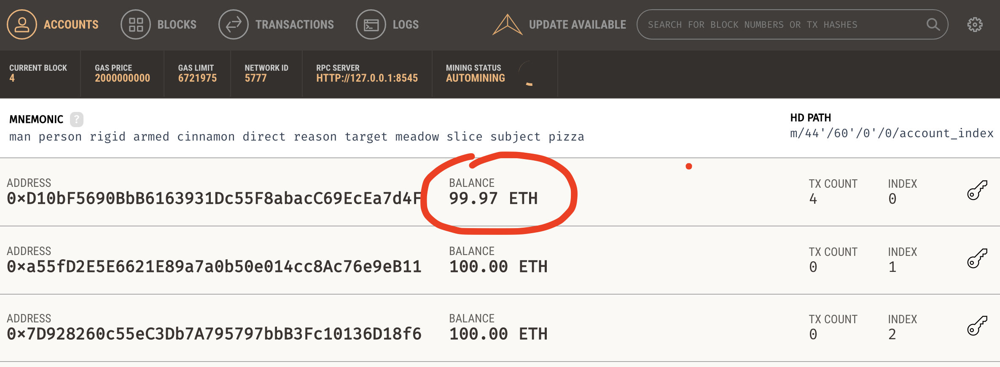

## Previously &hellip;

- [Introduction to Solidity](/hands-on/solidity-intro/)
- [Introduction to Truffle](/hands-on/truffle-intro/)
- [Introduction to Mocha](/hands-on/mocha-intro/)

## Recap

At this point, we have written a smart contract,
and have also written some tests using mocha, that are unrelated to the
smart contract.
We've done that intentionally, so as to learn the fundamentals of each
technology separately.

Now, we are about to combine the two - truffle comes with a test runner that
is a wrapper around Mocha.
Truffle's edition of Mocha comes with some **conveniences** that make it
possible to test smart contracts **easily**.

## Project environment

## Truffle Project

If you still have the `dadc-cars` project set up from the previous session,
you may re-use it.

Otherwise, follow the instructions in the
[introduction to truffle](/hands-on/truffle-intro/) hands-on.

Before proceeding with the next steps of this hands-on,
we **strongly suggest** that you commit your repository at in its
current state, that is after writing the smart contract,
but before writing any tests, before proceeding.

This will be very similar to the **Version control with git** section
of the [introduction to mocha](/hands-on/mocha-intro/) hands-on.

### Environment

#### NodeJs

Ensure that you have NodeJs installed, and is either version eight or ten.
You can check the version using:

```bash
$ node -v
v8.12.0
```

```bash
$ node -v
v10.15.0
```

If you have a UNIX-based operating system, you can install and switch between
different versions of NodeJS using
[nvm](https://github.com/creationix/nvm).

#### Python

In addition to this, make sure that you **do not** have python 3 on your `PATH`
while doing anything that requires `node-gyp`
(for example, while installing truffle),
as `node-gyp` assumes python 2 only.

#### Ganache

In a previous session, we used ganache to run
a simulated Ethereum network on localhost, and we made the distinction
between `truffle console --network development` and `truffle develop` -
as we wished to connect to ganache, we used the former.
Truffle has the ability to run its own simulated Ethereum network on
localhost as well, and if we wanted to make use of that,
we would use the latter.

When we run tests via truffle, it expects to connect to an existing
Ethereum network, and not need to spin up its own one,
thus we must **start ganache** and ensure that it is running before proceeding.

## Test structure

Create a new file which we will use to write our specification for
the `Cars` smart contract:

```bash
touch test/Cars.spec.js
```

Open this file, and enter the structure of a truffle test.

```javascript{1,5}
const Cars = artifacts.require('Cars');

const BN = web3.utils.BN;

contract('Cars - data storage', (accounts) => {

  // tests go here

});
```

### Comparing mocha to truffle

We notice that there are a lot of similarities between a standard mocha test,
and also the fact that there are some differences.

- Referencing the implementation
  - In both, the specification needs to reference the implementation.
  - In mocha, we use a standard `require` (CommonJS standard),
    or an `import` (ES Modules).
  - In truffle, we use `artifacts.require`, which returns a wrapped-by-truffle
    copy of the Solidity smart contract that is a Javascript object.
- Grouping of tests
  - In both, we can group similar or related tests together using
    function blocks.
  - In mocha, this is a `describe` block.
  - In truffle, this is a `contract` block.
- Group function parameters
  - In both, the first parameter is a string that describes the group
  - Mocha `describe` block's second parameter is a function that has zero
    parameters.
  - Truffle's `contract` block's second parameter is a function that has one
    parameter - a list of available accounts on the Ethereum network
- Group function body
  - In mocha's `describe` block, you can put tests or other `describe` blocks
    inside its function body.
  - In truffle's `contract` block, you can put tests inside its body.

## Running the tests

Right now, we have zero tests, but let's just run them anyway,
to make sure that we have done our set up correctly:

```bash
truffle test
```

If the output looks like this, you either do not have ganache running,
or your truffle configuration does not work:

```bash{2-4}
Could not connect to your Ethereum client with the following parameters:
    - host       > 127.0.0.1
    - port       > 8545
    - network_id > 5777
Please check that your Ethereum client:
    - is running
    - is accepting RPC connections (i.e., "--rpc" option is used in geth)
    - is accessible over the network
    - is properly configured in your Truffle configuration file (truffle-config.js)
```

If your output looks like this, it means **all good**!

```bash{11}
Using network 'development'.

Compiling your contracts...
===========================
> Compiling ./contracts/Cars.sol
> Compiling ./contracts/Migrations.sol
> Artifacts written to /var/folders/_9/ywg4bs883rd1zfh0n5544rr40000gn/T/test-119322-6582-10yrtmy.w73y
> Compiled successfully using:
   - solc: 0.5.0+commit.1d4f565a.Emscripten.clang

  0 passing (0ms)
```

Also, be sure to check ganache to ensure that the balance has decreased:



This happened because the first account, being the default one that truffle
makes use of for its operations, had to pay gas costs related to the
deployment of the smart contract -
this is really just a sanity check, to make sure that we are indeed connecting
to the Ethereum network (ganache on localhost) which we think we are.

### Congratulations

🎉🎉🎉 You have got truffle test runner to work.

Next, we will write out first tests.

## Next &hellip;

- [Testing Solidity Data Storage](/hands-on/testing/solidity-data-storage/)
- [Testing Solidity State Machines](/hands-on/testing/solidity-state-machines/)
- [Testing Solidity Events](/hands-on/testing/solidity-events/)
- [Mocking Solidity for Tests](/hands-on/testing/solidity-mocks/)
