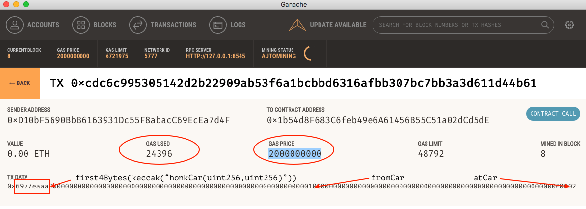
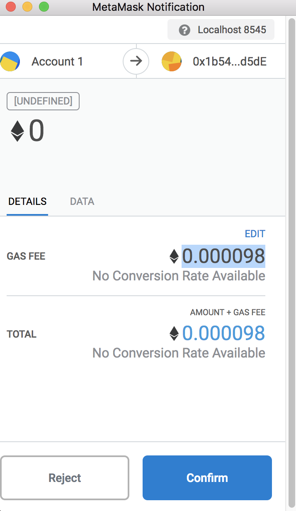

## Previously &hellip;

- [Project set up](/hands-on/web3/project-setup/)
- [Web3.js scaffolding](/hands-on/web3/scaffold/)
- [Query state](/hands-on/web3/query-state/)

## Mutate state

### Modify state variables

If you previously tried to query a car by ID,
you would have only managed to get errors -
we cannot query cars that do not exist yet!

Let's fix that, by allowing the user to buy some cars,
and add them to the system!

In the HTML file, ad the following:

```html
    <!-- add some state changers here -->

    <p>
      <label for="colourInput">Colour</label>
      <input type="text" id="colourInput" />
      <br />
      <label for="doorsInput">Doors</label>
      <input type="number" id="doorsInput" />
      <br />
      <button id="addCarButton">Add Car</button>
    </p>

```

At the bottom of the `init` function, add an event listener:

```javascript
  const addCarButton = document.querySelector('#addCarButton');
  addCarButton.addEventListener('click', addCar);

```

Then implement the `addCar` function:

```javascript
async function addCar() {
  console.log('Sending TX addCar');
  const colourInput = document.querySelector('#colourInput');
  const doorsInput = document.querySelector('#doorsInput');

  await CarsApp.contract.methods.addCar(
    colourInput.value, // '0xff00ff', // colour: purple
    doorsInput.value, // 4, // doors: 4
    0, // distance: 0
    0, // lat: 0
    0, // lon: 0
    // NOTE cannot use BN here, because of bug in web3.js, see:
    // https://github.com/ethereum/web3.js/issues/2077
  ).send({
    from: CarsApp.accounts[0],
    value: toWei('0.11', 'ether'),
  });

  console.log('car added');

  await queryNumCars();
}
```

When we do `addCar()`, we are using user input only for `colour` and `doors`.
The remaining parameters are defaults.
If we're sure that we'll never want to use non-default values for the other
parameters, we should consider removing them from the smart contract too!

In this case, we **are** mutating the state of the contract,
so we **do** need to send a transaction to the network -
we cannot merely query the state of the contract that we have locally!
That's why we are using `.send()` instead of `.call()` this time around.
Note that in the parameters to `.send()` we specify `value` to be 0.11 ETH.
This hard-coded value is one that we know will work.

Stretch goal:
Allow the user to specify how much they would like to pay
to the smart contract when they add a new car to it.

Stretch goal:
Instead of having to type the car colour as a hexadecimal number,
e.g. `0xff00ff`, allow the user to select one from a colour picker component.
[a-color-picker](https://narsenico.github.io/a-color-picker/)
looks like it is up to the job!

Back to queries:
Now that our user has the ability to add cars,
we can also now query cars by ID.
Try it!

### Add events

State variables are not the only type of mutation that can occur,
we also have events!

In our smart contract, it turns out that we have one function that emits events,
but does not modify any state variables - `honkCar`.
Let's allow our users to interact with that!

In the HTML file, add the following:

```html
    <!-- add some state changers here -->

    <p>
      <label for="fromCarInput">From Car</label>
      <input type="number" id="fromCarInput" />
      <br />
      <label for="atCarInput">At Car</label>
      <input type="number" id="atCarInput" />
      <br />
      <button id="honkCarButton">Honk Car</button>
    </p>

```

At the bottom of the `init` function, we'll add another event listener:

```javascript
  const honkCarButton = document.querySelector('#honkCarButton');
  honkCarButton.addEventListener('click', honkCar);

```

Next, we'll implement the `honkCar` handler function:

```javascript
async function honkCar() {
  console.log('Sending TX honkCar');
  const fromCarInput = document.querySelector('#fromCarInput');
  const atCarInput = document.querySelector('#atCarInput');

  const fromCar = +(fromCarInput.value);
  const atCar = +(atCarInput.value);

  await CarsApp.contract.methods.honkCar(
    fromCar,
    atCar,
  ).send({
    from: CarsApp.accounts[0],
  });

  console.log('car honked');

  await queryNumCars();
}

```

### Estimate Gas

Recall that every transaction processed by the Ethereum network must be
paid for.
The payment is denominated in tiny fractions of Ether called Wei.
Each EVM op code that is executed consumes a certain amount of gas,
add them all up, and you get the total amount of gas.

This is **not** a simple thing to work out, it turns out.
Thankfully web3.js provides a built in method that allows you to **estimate**
the amount that you need ahead of time.
In fact, when you call `.send()` on a method in a smart contract web3.js
automatically estimates the amount of gas needed for you behind the scenes.

However, occasionally you might want to manually override the default estimate.
Try the following:

```javascript
  const estimatedGas = await CarsApp.contract.methods.honkCar(
    fromCar,
    atCar,
  ).estimateGas({
    from: CarsApp.accounts[0],
  });

  await CarsApp.contract.methods.honkCar(
    fromCar,
    atCar,
  ).send({
    gas: Math.floor(estimatedGas / 2),
    from: CarsApp.accounts[0],
  });

```

What we've done above is to copy the `.send()` invocation,
and replaced it with `.estimateGas()` instead.
Now `estimatedGas` contains a number which web3.js thinks
it should send as part of the transaction (and defaults to).
Use `console.log()` if you wish to see the value -
it should be around 24000 for this particular one.

Next, when we are going to send the actual transaction,
we specify the amount of gas as something that is half of the estimate -
around 12000 in this case.
When `gas` is specified, web3.js does not perform another estimate,
it just uses the value that was specified.

Now try honking a car, and you will get an error that looks very similar to:

```
[ethjs-rpc] rpc error with payload
{"id":7459036589747,"jsonrpc":"2.0","params":["0x..."],"method":"eth_sendRawTransaction"} Error: base fee exceeds gas limit
```

This means that the amount of gas that you specified was insufficient
to complete running the function,
and since the user cannot afford to pay for the transaction,
the transaction does not occur,
and the user gets an error.

Now within `.send()` let's specify a different amount of gas,
and then honk the car again:

```javascript
    gas: (estimatedGas * 2),
```

This time we should not have gotten an error at all.
But why? It's because when we specify gas,
we're not specifying the exact amount that it should be,
but rather the **maximum** amount the transaction is allowed to consume.
Think of it as:

"I'm willing to pay up to **X** for this function call"

Let's make sure of that though,
take a look at that last transaction in Ganache:





The parts that we care about here are **Gas Used** and **Gas Price**.
Gas used is the actual amount that all the op codes invoked added up to.

For simple function calls like this one,
most likely the actual amount **Gas Used** is the same as the estimate,
but if you were to specify a value for `gas` in excess of this,
not all of it gets used.

The amount that the user has to pay in order to send the transaction -
and therefore execute the smart contract function -
is calculated by multiplying the **Gas Price** by **Gas Used**,
which gives you the total amount of Wei need.
One Wei is `10^-18` Ether, so that means that this function call cost
approximately `0.000049` Ether.
The MetaMask confirmation dialog earlier would have asked you for
`0.000098` Ether, and that matches what we expect here:
We offered to pay up to `0.000098`,
but only needed to pay `0.000049` in the end.

#### Examine transaction data

In the previous session we talked about how transaction data is encoded
when transmitted to the network in a rather theoretical manner.
Now let's take a look at that transaction in Ganache again.

- `0x6977eaaa` is the first 4 bytes of the hash of the canonical function
  signature for the `honkCar` method.
- `0x0000000000000000000000000000000000000000000000000000000000000001` is
  the first parameter of the `honkCar` method - `fromCar`
- `0x0000000000000000000000000000000000000000000000000000000000000002` is
  the second parameter of the `honkCar` method - `atCar`


What is worth noting here is that this transaction data was
assembled **client-side** within the web application, by web3.js,
and transmitted to the Ethereum network as how you see it here.

### Payable

This is very much similar to the code for the `addCar` handler,
however, you'll notice that the significant difference is that
in the transaction that we're sending,
we **do not** specify `value`.

Take a look at the function signature for `honkCar`:

```solidity
    function honkCar(uint256 carId, uint256 otherCarId)
        public
        onlyCarOwner(carId)

```

&hellip; and for `addCar`:

```solidity
    function addCar(
        bytes3 colour,
        uint8 doors,
        uint256 distance,
        uint16 lat,
        uint16 lon
    ) public payable returns(uint256 carId)

```

You'll notice that `addCar` is `payable` whereas `honkCar` is not.
Try making the user pay to honk a car, by specifying any `value` in `.send()`.
Does it work?
Why, or why not?

### Different accounts

Now switch accounts in MetaMask,
and have this other account add a car of its own.
At this point, the smart contract should contain at least two different cars,
and them owned by different accounts.

Try the following:

- Honk a car that the current account owns.
- Honk another car that is owned by a different account.
- Honk a car that does not exist
- Honk at a car that does not exist.

In each case, what happens?

## Congratulations

🎉🎉🎉 You have given the users of you DApp the ability to alter the state of the smart contract -
now the DApp is truly interactive!

Next, we will listen for events emitted by the smart contract.

## Next &hellip;

- [Listen to events](/hands-on/web3/listen-events/)
